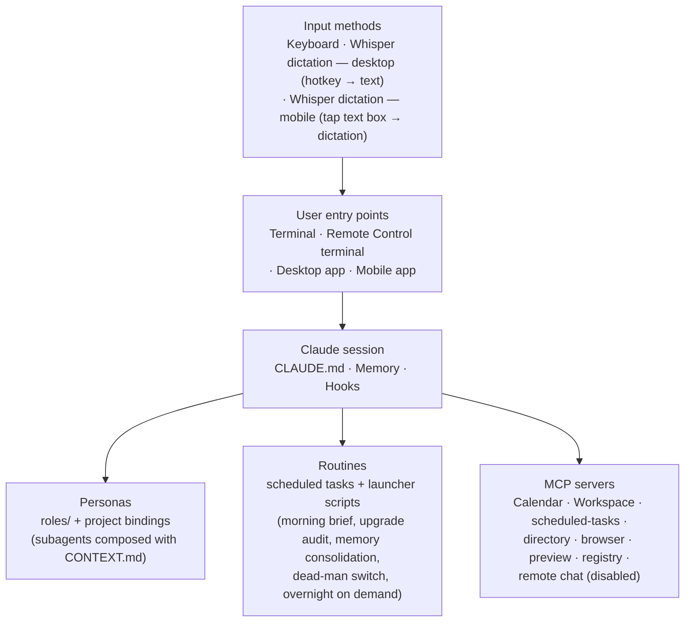
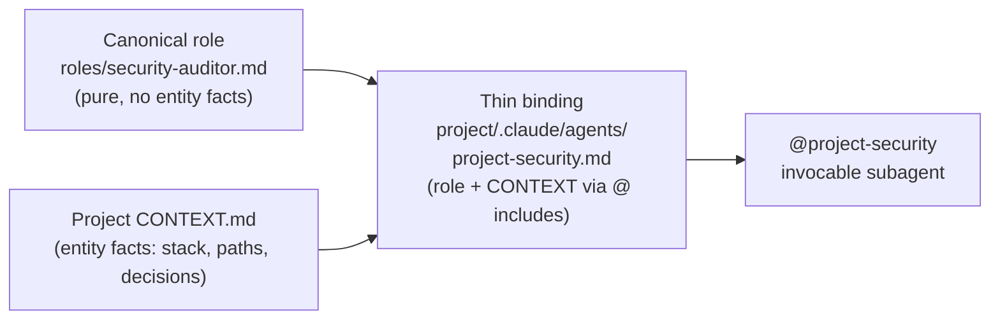
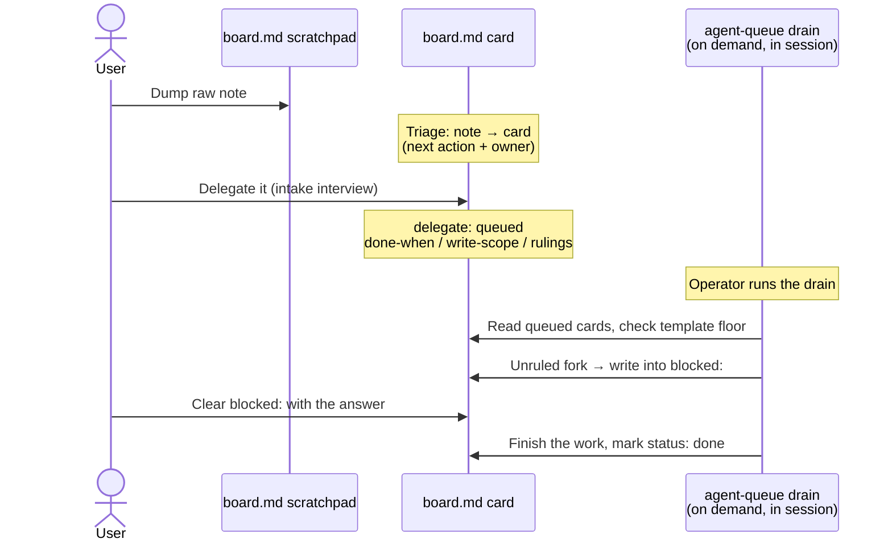

# Agent Workspace — Meta Architecture *(redacted)*

> **Scope:** how a personal **agent workspace** is wired *for the agent*. Personas, routines, hooks, memory, and the coordination layer between them. The worked example runs on Claude Code (so file conventions like `CLAUDE.md` and `.claude/skills/` are Claude-Code-specific), but the architectural patterns port to any agent substrate. **Not** the architecture of any individual project inside it — project application architecture lives alongside each project.
>
> **Audience:** anyone curious about how a practical agent workspace is structured end-to-end, regardless of which agent runtime they use.
>
> **Last updated:** 2026-10-03. What changed, and when, is in [CHANGELOG.md](CHANGELOG.md). The entries this header used to carry are in [docs/history.md](docs/history.md).

## Contents

1. [Layers at a glance](#1-layers-at-a-glance)
2. [Modules — cohesive clusters by purpose](#2-modules--cohesive-clusters-by-purpose)
3. [Personas — the Roles Library](#3-personas--the-roles-library)
4. [Routines — recurring agents and one-shot launchers](#4-routines--recurring-agents-and-one-shot-launchers)
5. [Hooks — automatic behaviours on events](#5-hooks--automatic-behaviours-on-events)
6. [Skills — invokable capabilities](#6-skills--invokable-capabilities)
7. [Subagents — specialised workers](#7-subagents--specialised-workers)
8. [MCP servers — external capability bridges](#8-mcp-servers--external-capability-bridges)
9. [Memory system — persistent context across sessions](#9-memory-system--persistent-context-across-sessions)
10. [Task coordination layer](#10-task-coordination-layer)
11. [File protection / safety](#11-file-protection--safety)
12. [Project layout](#12-project-layout)
13. [Where things live (quick reference)](#13-where-things-live-quick-reference)
14. [Source attribution — patterns this workspace draws on](#14-source-attribution--patterns-this-workspace-draws-on)
15. [Maintenance](#15-maintenance)

Companion docs: [ADOPTION.md](ADOPTION.md) — 5-step walkthrough for setting up a similar workspace · [samples/](samples/) — scaffold files illustrating each layer.

## Conventions

- **`<workspace>`** / **`<home>`** / **`<project>`** are placeholders; substitute your own paths.
- Type markers in tables:
  - **[stock]** — ships with Claude Code out of the box
  - **[plugin]** — installed via a plugin
  - **[local]** — local external install (npm global, uvx, standalone binary)
  - **[custom]** — written for this workspace

---

## 1. Layers at a glance

```mermaid
flowchart TB
    I["Input methods<br/>Keyboard · Whisper dictation — desktop (hotkey → text)<br/>· Whisper dictation — mobile (tap text box → dictation)"]
    E["User entry points<br/>Terminal · Remote Control terminal<br/>· Desktop app · Mobile app"]
    S["Claude session<br/>CLAUDE.md · Memory · Hooks"]
    P["Personas<br/>roles/ + project bindings<br/>(subagents composed with CONTEXT.md)"]
    R["Routines<br/>scheduled tasks + launcher scripts<br/>(morning brief, upgrade audit, memory consolidation,<br/>dead-man switch, overnight on demand)"]
    M["MCP servers<br/>Calendar · Workspace · scheduled-tasks ·<br/>directory · browser · preview · registry ·<br/>remote chat (disabled)"]
    I --> E
    E --> S
    S --> P
    S --> R
    S --> M
```

Input methods layer above entry points: text typed into any surface (terminal, Remote Control terminal, desktop app, mobile app) can come from a keyboard or from an OS-level Whisper dictation layer. The same dictation tool runs on both desktop (hotkey → text into focused field) and phone (tap any text box → dictation icon), so voice input is available everywhere the user talks to Claude without any workspace-side integration. Four surfaces sit above the Claude session (entry points), three sit below (personas, routines, MCP). Each section from §3 onward details one slice (§2 is the *modular* view of the same surface — see Contents).

---

## 2. Modules — cohesive clusters by purpose

A *module* is a cohesive cluster of files (subagents, skills, scripts, state) that shares one upgrade boundary. The §1 layered view is the inventory by type; this section is the same content sliced by purpose. Shared primitives are cross-referenced, not duplicated. The Audit module best-practice-checks **all modules in one full sweep every run** (the earlier 4-group weekly rotation was retired — an on-demand audit should surface the complete opportunity set in a single pass, bounded by subagent concurrency rather than a rotation; see the audit sample's Phase 2.9 under [samples/](samples/)), reading a per-module best-practice map (sources + concrete checks + gaps). Upgrade findings are captured exhaustively into a deduplicated **backlog**: each upgrade carries a stable source-derived key, so a fit-passing upgrade is recorded once and never re-surfaced on later runs, and none is dropped by a fixed finding cap.

| Module | Charter | Subagents | Skills | Scripts | State | Owner doc |
|---|---|---|---|---|---|---|
| **Audit** | Weekly + on-demand upgrade audit. First job: find improvements — public-source research (Phase 2.5b) plus a module best-practice critique (Phase 2.9). The same sweep reviews configs, hooks, security envelope, plugin/MCP bloat, memory drift. Findings → ledger → full report at `<workspace>/tasks/audit/SETUP_REVIEW.md` + a short digest in the task list (relocated 2026-06-10 — the full block was taxing every reader of the task list). Cheap assertions run as code (`audit_checks/run_all.py`); externally-sourced findings never auto-apply (provenance Gate 0); pending queue drained via `audit-workthrough`. Router ledger lists unlabeled dispatches; three audit checks carry known-positive fixtures; long-running agents carry a per-agent 1h cache TTL; every role carries a Red Flags section. | `audit`, `audit-second-opinion` | `audit-workthrough` | `audit.bat`, `audit-second-opinion.bat`, `audit_ledger.py`, `audit_cost.py`, `audit_checks/run_all.py`, `security/check_task_freshness.py`, `ghost_token_counter.py` (shared with *Token Budget*), `tests/audit_canaries/` | `<workspace>/scripts/_state/audit_findings.jsonl`, `audit_cost.jsonl`, `ghost_tokens.db`, `tasks/audit/SETUP_REVIEW.md`, `tasks/scheduled-logs/upgrade-audit_*.log` | `<workspace>/.claude/agents/audit.md` |
| **Heartbeat** *(retired)* | **RETIRED 2026-08 in the source workspace**, superseded by the *Task board* module's explicit delegation queue. The row stays as predecessor documentation, because the classify-then-act half still holds wherever the mandate is already unambiguous; discovery is the half that failed. What it was: a cron-driven (2h) project manager, **gated from 2026-06-10**, where a Stage-0 wrapper preflight (`preflight_gate.py`) skipped the LLM entirely when the watched task files were unchanged, the deterministic scans passed, and an agent cycle had run <24h ago, and the act stage ran the work-tier model at max effort. Classify-then-act on the task + questions files; build `has-default` tasks in sandbox; lodge to review queue; log rejections as ADRs. Why it went: clarifying questions landed in a tracker file nobody opened (thirteen unanswered at the end) and the unattended runtime failed dark for about five weeks behind an expired ambient credential. The container-isolated variant was parked before retirement (the agent CLI's subscription auth needs the desktop app's IPC). | `heartbeat` | `review-queue` | `<workspace>/scripts/heartbeat/*` (preflight_gate, classify_task, create_staging, check_rejections, idle_observations, host_reviewer, anthropic_proxy, observe_cycles) | `<workspace>/tasks/HEARTBEAT_REVIEWS.md`, `HEARTBEAT_REJECTIONS.md`, `tasks/heartbeat-sandbox/`, `scripts/_state/heartbeat_gate.json`, `tasks/scheduled-logs/heartbeat-monitor_*.log` | `<workspace>/tasks/HEARTBEAT.md`, project-level `OBSERVATION.md` runbook |
| **Brief** | Daily situational-awareness digest: appointments (14d), local weather, AI news, task counts, open questions, overnight activity → markdown → HTML → SMTP self-email. Idempotent. | — | — | `appointments.py`, `ai_news.py`, `brief_render.py`, `send_self_email.py` | `<workspace>/tasks/morning_brief_YYYY-MM-DD.md`, `scripts/_state/ai_news_seen.db`, `tasks/scheduled-logs/morning-brief_*.log` | `<home>/.claude/scheduled-tasks/morning-brief/SKILL.md` |
| **Inbox** | Hands-on processing of email + photo inbox. Classify against rules/registry, group by proposed action, gate per-batch approval before applying labels/archive/trash or writing to a personal finance ledger. Iron rule: no state changes without approval. | — | `email-triage`, `file-receipts` | `email_rules.py`, `receipts_pipeline.py`, `bill_tracker.py` | personal-finance ledger workbooks + photo inbox folder; consumes the email-rules + services-registry (owned by *Reference data*) | skill `SKILL.md` files + a feedback memory codifying the iron rule |
| **Roles** | Pure persona library (18 canonical roles) + project bindings under `.claude/agents/`. Composition: a thin binding names the canonical role + project `CONTEXT.md` as `@` lines, which `roles/_compose.py` renders into hash-marked blocks, because the runtime never expands `@` inside an agent file (2026-09-14). Validator runners: the audit's coded checks (`check_roles_validator`, folded in from the retired `health` skill on 2026-09-14, beside `check_roles_compose`) plus the audit's post-write step (the 2-hourly heartbeat that ran it was retired 2026-08-08). | 18 canonical + project bindings | `role-pressure-test` | `<workspace>/roles/_validate.py`, `<workspace>/roles/_compose.py` | — | `<workspace>/roles/README.md`, `<workspace>/roles/_template.md` |
| **Memory** | User-global file-based memory: `MEMORY.md` index + topic files (`user_*`, `feedback_*`, `project_*`, `reference_*`) + `episodes/`. Weekly consolidation, run through a structural no-regression gate before adoption: snapshot the memory tree → let the pass edit → re-check after, and reject the whole pass on a newly broken source reference, an index-ceiling breach, a dropped standing-rule line, or injected directive-shaped text. A consolidation pass rewrites the agent's own standing context, so a correctness signal alone can't certify it safe to keep. Four-op discipline per fact. | — | `consolidate-memory` (scheduled-task) | `<workspace>/scripts/memory_lint.py` | `<home>/.claude/projects/<workspace-id>/memory/*` | `<home>/.claude/scheduled-tasks/consolidate-memory/SKILL.md`, user-global `CLAUDE.md § Memory hygiene` |
| **Security envelope** | Multi-layer file/command protection: PreToolUse hooks (Edit/Write/NotebookEdit + Bash/PowerShell + WebFetch + an egress gate on the Google MCP servers + a memory-write screen), each writing an armed heartbeat to `scripts/_state/guard_armed/` since 2026-09-24, with the shell guard ending any check still running at about 4.25 s with a block (2026-09-26), command-safety plugin (interactive CLI only), PreCompact transcript backup, the always-applies `permissions.deny` floor (re-homed from `autoMode.hard_deny` on the 2026-06-16 *Sentinel* cutover; `autoMode` doesn't apply under bypass). Credential discipline (password-manager + `.env` exception). The *Sentinel* module owns the zero-prompt posture + post-hoc monitor built on these hooks. | — | — | `<workspace>/scripts/security/check_bash_command.py`, `check_file_protection.py`, `check_webfetch.py`, `check_webfetch_egress.py`, `check_mcp_egress.py` (+ `check_mcp_egress_selftest.py`), `memory_screen_patterns.py`, `mcp_manifest_pin.py`, `precompact_backup.py` | hook execution log, `<workspace>/tasks/transcript-backups/`, `<workspace>/scripts/_state/guard_armed/` | META_ARCH § Hooks + § File protection |
| **Backup** | Encrypted incremental backup to S3-compatible object storage via `restic`. Credentials resolved from a password-manager CLI at runtime. Verify via check + file-level restore round-trip. Second, independent copy (2026-09-14): an encrypted 7-Zip archive (AES-256, hidden headers) of the workspace and the user-level config, built in a temp dir and moved into a cloud-drive sync folder, newest three kept; its exclude list strips runtime state and every credential-shaped file, because the archive is not a client-encrypted repo the way restic is. | — | — | `backup-restic.bat`/`.ps1`, `restic-verify.bat`/`.ps1`, `backup-excludes.txt`, `backup-drive.ps1`, `backup-drive-excludes.txt` | off-machine restic repo + cloud-drive archive | META_ARCH § Routines launcher rows |
| **Session workflow** | Skills that manage the session experience start-to-finish: orientation at start, terse-mode mid-session, checkpoints to bridge compactions, task readouts, close-out at end. `<workspace>/tasks/checkpoints/` is the cross-session continuity store. The `wrap` close-out fires a read-only **drift scan** (`wrap_drift_scan.py`) at the final step: when a task finishes it surfaces workspace-wide drift the operator is otherwise blind to (stale CONTEXT.md/PLAN.md, fired strategy triggers, backup staleness, aging open questions) for them to action while still in-context. The scan is the worked example of the **loop-selection framework** (see below): a close-out is recurring and verifiable but judgment-heavy, so it lands in the SURFACE bucket — a nudge, not silent autonomy. | — | `orient`, `wrap`, `tasks`, `context-save`, `context-restore`, `terse-mode` | `wrap_drift_scan.py` | `<workspace>/tasks/checkpoints/YYYY-MM-DD_HHMM_<slug>.md` | each skill's `SKILL.md` |
| **Public mirror** | Redacted world-readable snapshot of the workspace published as a sister repo (this repo). Privacy bar maintained by redaction discipline; periodic mirror-sweep PRs. `ATTRIBUTION.md` + `ADOPTION.md` + `SUPPORT.md` + `samples/` are public-only assets. | — | — | (manual mirror-sweep workflow; no script yet) | mirror commit log + public-only docs | this repo's own `CLAUDE.md` (privacy iron law + grep checklist) |
| **Reference data** | Durable structured reference inputs consumed by multiple modules. Each input carries its own schema (registry frontmatter, YAML rules, research-brief README format). | — | — | — | `<workspace>/Reference/services-registry.md` (consumed by *Audit*, *Inbox* bill-tracker, *Brief* renewal scan), `<workspace>/Reference/email-rules.md` (consumed by *Inbox* email-triage), `<workspace>/Reference/Research/` (consumed by *Audit* + ad-hoc) | `Reference/Research/README.md` (briefs); inline frontmatter in `services-registry.md` + `email-rules.md` for schemas |
| **Token Budget** | **Added 2026-06-10 (absorbs the former *Context Budget* not-yet-module).** Measure, cap, and reduce token spend across interactive, scheduled, and API workloads — driven by the mid-2026 split of headless agent usage into a capped monthly credit pool at API rates. Measurement: a daily `token_report.py log` (run by the brief) + the ghost-token baseline; the audit's Phase 1 reads the trend (a +25%-over-median rule). Policy — a **tiered-execution rule**: plan at the top tier, hand implementation to subagents on a lower tier, review at the top tier. **Refined mid-August 2026 into a measured control loop (Pattern 15):** a lane-split measurement (orchestrator vs subagent transcripts, by token class and model) showed cost was overwhelmingly input-side at a ~95% cache-hit rate, which reshaped the levers — always-on workflow orchestration became opt-in, max effort was scoped to judgment lanes only (output was ~11% of cost, so effort is a quality dial), and execution builders dropped one further rung within the provider ladder as a registered trial with a kill criterion (rework rate over a marker convention, denominated in dispatches). The trial's instrument (`tier_metrics.py`: spend trend vs baseline, lane split, cache-hit floor, adoption share, rework ratio) feeds the audit's checks-as-code, and the audit carries a standing hold/tweak/kill assessment step until the trial's review date. The trial was reviewed on 2026-09-14 and kept, on zero rework across 117 dispatches. **Picker ruling (2026-09-14):** interactive sessions stay at Extra (xhigh) effort, and a frontier-hard judgment goes to a separate max-effort reasoning lane rather than a mid-session effort switch. Scheduled/unattended work runs the work tier (wrapper model map); the top tier stays interactive/escalation-only. (A fixed per-task thinking-token cap was dropped once the models moved to adaptive thinking — effort is the depth control now.) Cache hygiene (corrected 2026-09-02 by a transcript scan): the re-writes that matter are resumes after an idle gap longer than the cache lifetime, mid-session model switches and compaction; editing an always-loaded file mid-session does not re-write the prefix, because the loaded copy is captured at session start — so wrap before a break that outlives the cache and change models only in a fresh session. `cache_write_scan.py` attributes a transcript's cache writes to those causes so the rule stays measured. **Keep-alive (2026-09-08):** the idle-gap cause dominated both scanned sessions (44% and 69% of cache-write tokens; the 82% recorded here until 2026-09-25 was every re-write cause together), and where cache reads are priced at 0.025x a refresh costs about 1/80th of a 2x re-write, so `orient` step 4 arms a self-paced wakeup every 50 minutes (single-dot reply, 60-hour self-stop at the crossover, interactive sessions only). The one-hour TTL itself is set with `promptCacheTtl: "1h"` in the user settings file, which reaches the desktop app; the launcher env var never did. | — | `session-report` (sibling instrument) | `token_report.py`, `output_share.py` (output's dollar share of measured spend over a date range, 2026-09-26), `tier_metrics.py`, `cache_write_scan.py`, `ghost_token_counter.py` (shared with *Audit*), `heartbeat/preflight_gate.py` (shared with *Heartbeat*) | `<workspace>/scripts/_state/token_history.jsonl`, `ghost_tokens.db`, `heartbeat_gate.json` | this row + `token_report.py` docstring + a per-module best-practice brief in `Reference/Research/` |
| **Sentinel** | **Added 2026-06-16.** Zero-prompt pass-through + silent deny-floor + quiet post-hoc monitor — removes approval fatigue without losing enforcement. `permissions.defaultMode = bypassPermissions` (set in user-global settings only — project settings ignore it) removes every interactive prompt; an always-applies `permissions.deny` floor (catastrophic recursive deletes re-homed from `autoMode` + security-envelope self-modification protection [settings files, MCP config, the hook-scripts dir, the scheduled-tasks dir] + secret-file globs) plus the *Security envelope* PreToolUse hooks block the irreversible / outward / self-modifying minority **silently** — asking is exactly what's being removed. **One deliberate exception (added later):** a single high-churn, low-risk local config file was moved deny→**ask**, so the agent can edit it under a one-click approval prompt — confirming an `ask` rule still fires under `bypassPermissions`, while the enforcement core (the settings file itself, MCP config, the hook-scripts dir, the deny-floor) stays hard-denied. It was the lone `ask` exception until 2026-09-24, when three browser-automation tools that can upload files or run page scripts (`file_upload`, `upload_image`, `javascript_tool`) joined the `ask` tier; everything else is silent-block or silent-allow. A deterministic PostToolUse action-log (`sentinel_actionlog.py` → `sentinel_log.py`) records every call (shapes/hashes, never secrets); a closed set of hard tripwires (an executed envelope-write, an exec-hijack or a dangerous git command that actually ran (read statement by statement since 2026-09-26), raw shell egress, a credential-shaped string in an outbound payload, a read of a known secret-key file) fires a desktop toast. Near-zero false alerts **by construction**: silent-log default, closed toast set, time-windowed shape-dedup, reads-never-toasted (bar the narrow secret-read), fail-open. **MVP shipped; the Layer-2 LLM-judge digest (the semantic "truly unusual" layer) is deferred** until the action-log has real data to tune its high bar against — shipping it untuned would just trade approval fatigue for alert fatigue. Single-line revert: flip the mode back to the prompting default. Honest residual: the reversible majority becomes detect-not-prevent, and an in-process script write/egress bypasses the shell + edit layers (detection-only, backstopped by the encrypted backup). Bypass applies to the local CLI/desktop runtime only (cloud/SDK runtimes ignore it). Builds on *Security envelope* (which owns the `check_*.py` hooks). | — | — | `<workspace>/scripts/security/sentinel_actionlog.py`, `sentinel_log.py`, `<workspace>/scripts/security_digest.py` (the alarm-channel reader), extends `check_{bash_command,file_protection,webfetch}.py`, `<workspace>/tests/security_canaries/floor_canary.py` | `<workspace>/scripts/_state/sentinel_actionlog.jsonl`, `sentinel_notify_state.json`; the user-global settings file (`defaultMode` + the deny floor) | this row + `sentinel_log.py` docstring |
| **Task board** | **Added 2026-08. Successor to the retired *Heartbeat* module.** One canonical markdown card store for everything outstanding, rendered to a locally served view. Markdown is the truth and the page is a view, overwritten on every render. Columns are **categories, never workflow stages** (`blocked:` is a field that renders as a badge, so a waiting card stays in the domain you go looking for it in), and a `repeat:` card leaves its column for a collapsed **recurring lane** excluded from every count, so standing rhythms never inflate the outstanding figure. `stats` warns once active cards pass a ceiling of 50, with those rhythm cards excluded because they never close (2026-09-26). `owner:` (`me` / `agent` / `external`) is the highest-value field, and a card without a literal next action is not a card. **Explicit delegation queue:** `delegate: queued` is the entire authorization surface for agent work, set only by the operator, and an intake interview at delegation time records `done-when:` (always confirmed, never inferred), `write-scope:`, `constraints:` and pre-rulings for foreseeable forks. A template floor gates actionability; the `agent-queue` drain actions the queue on demand in an interactive session, and a fork the intake did not pre-rule is written back into the card's `blocked:` field instead of a separate questions file. No cron sits behind any of it. The `overnight` skill (§6, 2026-09-24) drains the same queue unattended for hours behind a usage gate. Machine queues roll up to one live-count card each rather than exploding into cards; the live ones are audit findings and open questions (the lesson-candidate and review cards went with those retired lanes). **Analytics ride the served view:** two read-only pages computed per load — `/flow` (board motion: vitals, closes per week, cycle time, aging by days since last touch) and `/metrics` (daily spend, a full-history weekly capacity chart with four-week and all-time average lines, per-task cost, a per-model usage profile, throughput beside queue health). Since 2026-09-26 a task's tokens count the main thread plus its subagents, with the split shown and subagent models merged into the per-model rollup, and a session wrapped more than once counts only its growth over the highest figure already logged. A `wrap` step logs the per-task token record that feeds the cost panels, so freshness is event-driven and a stale tail means no wrap has run. | — | `board`, `agent-queue`, `overnight` | the board engine (`parse` / `validate` / `render` / `serve` / `stats` / `selftest` subcommands; a malformed card is a hard error that blocks the render) + the per-task token-log and rescan subcommands, `overnight.py` | `<workspace>/board/board.md` (canonical cards + the capture scratchpad), `<workspace>/board/board.html` (generated view, never hand-edited), `<workspace>/scripts/_state/task_token_log.jsonl`, `<workspace>/tasks/overnight/` (overnight run state and reports) | [`samples/board/README.md`](samples/board/README.md) |
| **Site & agent surface** | **Added 2026-08-30.** The practice site as a discovery instrument, human- and agent-facing. Four free browser tools (a two-door maturity/readiness assessment over the pattern set's six dimensions, a redaction pre-flight, a context carry-cost calculator priced with measured numbers), all computing client-side with capture strictly opt-in (an unchecked telemetry box and an explicit email-a-report action; pasted text never leaves the browser). The same worker exposes the practice to agents: an **MCP server** (stateless streamable HTTP, hand-rolled, zero dependencies) with five tools — `lookup_pattern`, `assess_workspace`, `price_context_read`, `check_redaction`, and `request_capability`, the unmet-demand channel ("tell this server what you needed but didn't find"); calls to tool names that don't exist are logged too, so expected-but-absent capabilities surface. Discovery: `/.well-known/agent.json`, `patterns.json`, `llms.txt`, permissive robots. One upgrade boundary: the site worker deploy. Telemetry is treated as a positioning experiment, not a demand register, until call patterns correlate with humans arriving. | — | — | the site worker (routes: capture + MCP), a KV aggregate reader | a consented capture store (opt-in telemetry, report requests, MCP call rows) | the site's consent-design record; live surface at [jamesross.ai](https://jamesross.ai/llms.txt) |
| **Content machinery (operating layer)** | **Added 2026-08-30.** The workspace-side operating layer around the public [signal-sweep](https://github.com/signal-sweep/signal-sweep) engine, which documents its own internals — this module points there and owns what the repo does not ship: the outward-posting skills and their **per-item human approval** Iron Laws (no reply, comment, or post ships without an explicit per-item yes; nothing outward is ever scheduled), the posted-answer ledgers and own-repo engagement intake, promotion placement metrics, the newsletter channel conventions, the canonical Q&A home (the flagship's Discussions, watched by the same intake), and an own-property mention watch so shares of the site or tools surface in the digest. One upgrade boundary: the skills + workspace scripts/state (the engine repo upgrades on its own cadence). **Re-pointed 2026-09-08: this layer is a learning loop.** Its one metric is whether an interaction changed a standing file, recorded in an append-only learning ledger: a row is added when a reply is drained, a human later rules it a lift, a reject or a defer, and the report warns when ten decided items in a row produced no lift. Teardowns publish only when their "what changed here" section names a lift. The thread sweep looks for threads that will push back on an answer rather than threads to answer. The publishing cadences and the scheduled traffic capture are retired, and the demand registers are parked. Reach, subscribers and reply volume are no longer outputs of this layer. | — | the sweep / response-check / teardown skills | promotion metrics, engagement intake, a capture-store reader, the thread-sweep and response-check engines, the learning ledger | posted ledgers, intake queue, demand log | [signal-sweep](https://github.com/signal-sweep/signal-sweep) for the engine; this row for the operating layer |

**Module tags** (cross-cutting themes for grouping + navigation; a module can carry several, owner in **bold** — these mirror the repo's GitHub topics so the internal map and the discovery surface share one vocabulary):

- **`token-optimization`** / `context-engineering` — **Token Budget** (owner) · *Audit* (ghost-token baseline + the over-median spend-trend rule) · *Task board* (the per-task token log behind the metrics page) · *Session workflow* (terse-mode, checkpoints that cut re-load cost) · *Heartbeat* (retired; its Stage-0 preflight gate was the flagship spend-avoidance control while the cron ran). The most cross-cutting tag in the workspace.
- `safety` — **Security envelope** (owner) · *Task board* (delegation is operator-set; the template floor and the write-scope field bound what a drain may touch) · *Audit* (security sweep) · *Heartbeat* (retired; sandboxed builds + review gate).
- `agent-memory` — **Memory** (owner) · *Audit* (retrospective + semantic-drift check).
- `autonomy` — **Task board** (owner since 2026-08 — an explicit queue drained on demand, no cron) · *Brief* · *Inbox* (scheduled / approval-gated). The previous owner, *Heartbeat*, was retired; the tag now describes bounded delegation rather than a background cycle.
- `knowledge` — **Reference data** (owner) · *Roles* · *Memory*.

**Shared primitives** (belong to multiple modules — cross-referenced, not duplicated):

- `ghost_token_counter.py` — *Audit* (Phase 1 baseline) + *Token Budget*.
- `<workspace>/scripts/heartbeat/preflight_gate.py` — the retired *Heartbeat* module owned it, and *Token Budget* claimed it as its flagship spend-avoidance control for as long as the cron ran. Dormant since the retirement; kept as the worked example of gating a scheduled run before any model call.
- `<workspace>/scripts/_state/audit_findings.jsonl` — *Audit* writes; the *Task board* reads the pending count for its rolled-up audit card.
- `<workspace>/scripts/security/*` — *Security envelope* owns; *Audit* consumes (as did the retired *Heartbeat*).
- `<workspace>/roles/` library — *Roles* owns; every project module that composes a binding consumes it.
- `<workspace>/Reference/services-registry.md` — *Reference data* owns; *Inbox*, *Audit*, *Brief* consume.
- `<workspace>/Reference/email-rules.md` — *Reference data* owns; *Inbox* consumes.

**Standalone skills (not modules)** — singletons in `<workspace>/.claude/skills/` that don't cluster into a module:

- `verify-completion` — pre-completion self-review gate.
- `systematic-debugging` — structured bug-investigation methodology.
- ~~`health`~~ retired 2026-09-14: its eight checks run in `audit_checks/run_all.py`, which appends the health trend history; the skill file is a pointer.
- ~~`subagent-driven-development`~~ cut 2026-09-23 (scaffold review; archived).
- `dispatching-parallel-agents` — fan out independent subagents in parallel.
- `grocery-run` — shopping-agent stub (placeholder).
- `writing-agent-behavior` — author/revise BEHAVIOR.md conduct specs: review-time artifacts (never auto-loaded into runtime prompts) capturing recurring, trajectory-judgeable agent conduct, with a five-class calibration matrix (positive, negative, lucky-correct negative, outside-scope, allowed boundary). Adapted from [braintrustdata/agentbehavior](https://github.com/braintrustdata/agentbehavior) (Apache-2.0); the unpublished upstream CLI is replaced by manual validation against the bundled spec. Companion primitive: a stdlib choice-scored LLM-judge script (judge specs as data files, code-enforced verdicts, per-criterion boolean decomposition, automatic untrusted-content wrapping; adapted from [braintrustdata/autoevals](https://github.com/braintrustdata/autoevals), MIT). Both scaffold-registered with review dates.

**Anthropic + plugin skills** are listed in §6 Skills (not workspace-owned, so not modules). They include harness-config skills (`update-config`, `keybindings-help`, `fewer-permission-prompts`, `loop`, `schedule`, `claude-api`), publishing primitives (`pdf`, `docx`, `pptx`, `xlsx`), and the setup skill (`setup-claude`). `hookify` is a workspace skill, not a plugin one.

**Not yet modules** (loose ends worth naming for future cohesion):

- *Voice / Home Integration* — a home-voice-interface project + a voice-booking-agent project. (An earlier browser voice/text web-UI MCP server was retired 2026-08: unused once an OS-level dictation tool covered voice input — see CHANGELOG.)
- *Containerised execution* — the retired Heartbeat was the first instance; the sidecar pattern + check-mounts + anthropic-proxy generalise. Parked before the retirement (subscription auth needs the desktop app's IPC) and no longer has a host module; it waits for a second concrete instance.

*(The former* Context Budget *entry graduated to the **Token Budget** module on 2026-06-10.)*

**Dynamic workflows** (runtime-orchestrated subagent scripts, invoked as `/<name>`; distinct from skills, which the agent follows turn-by-turn):

- `best-of-n` — **Cut 2026-09-23** (scaffold review; archived). **Added 2026-06-18.** Best-of-N + rubric-judge for one HIGH-cost-of-error one-shot decision where no single test verifies the answer. Generates N deliberately *divergent* attempts in parallel (a different seed lens/role/strategy each — risk-first, upside-first, first-principles/contrarian — enforced by a divergence contract), then a judge ranks them against an explicit rubric (correctness, risk, fit, reversibility) and returns the recommended decision plus a synthesis grafting the best of the runners-up. **Judge shape upgraded 2026-08-09:** the judge runs a *different, higher-tier model* than the attempts (same-model self-preference bias is measured at 10–25%), writes its reasoning before any verdict, picks anchored labels that code maps to numbers (an off-list label fails loudly, never a silent zero), and runs twice — forward and reversed presentation order — with disagreement surfaced to the human rather than resolved silently. The judge is the checkable selection mechanism that grounds the second pass. The most expensive coordination route — used sparingly, not for routine work.

**Reasoning-measurement + scaffold discipline (cross-cutting policy, added 2026-06-18 — not a module).** *The method is now documented in full at [EVALUATION.md](EVALUATION.md), with the harness, the authoring guide and three representative cases shipped as samples.* A workspace that keeps adding skills, rules, and always-loaded directives needs a way to tell which ones actually help. Two pieces hold that line. First, a **golden-set reasoning-regression suite**: a few dozen frozen cases with deterministically-checkable expectations, replayed headless at audit time under a variance floor (each case run several times, reported as a pass-rate ± stddev, never a single scalar, and since 2026-09-23 stating the smallest detectable effect before certifying anything, about 0.17 unpaired on the golden set) and trended — the first instrument that watches answer *accuracy* drift rather than config drift. Second, a **scaffold-discipline rule**: every capability scaffold (a skill, an always-loaded directive, a rule, a gate, a workflow) registers a falsifiable hypothesis and a review date; at review it must beat baseline on the suite or it is cut. The first register review ran on 2026-09-23: 30 due rows were ruled, 11 scaffolds cut and archived, and 6 converted. Removal is a first-class outcome, because bloat suppresses effective intelligence as much as a good scaffold raises it — a build-biased upgrade pass undervalues trimming. Companion to the self-edit-loop gate (Pattern 10): a correctness signal certifies a *scaffold* the same way a human gate certifies a *self-edit*. These ride the Audit module's upgrade boundary, not a module of their own.

**Loop-selection framework (cross-cutting decision tool, added 2026-06-18 — not a module).** A reusable test for the question a capable agent invites: given a recurring task, does it earn an autonomous loop, a surfacing nudge, or stay hand-driven? Two layers. First a **loop stack** for tagging: agent loop (a model calls tools until done) → verification loop (grade the output, feed failures back) → event-driven loop (fires on a hook, not a clock) → learning loop (proposes changes to standing files); you move up the stack for leverage and down for reliability. Then a **four-box selection test**: a task earns an autonomous loop only when it is all of recurring, mechanically verifiable (a script/exit-code/diff confirms it, not taste), low-judgment-per-instance, and headless-executable. An **irreversibility override** caps any outward or destructive act (email sent, comment posted, money moved, history pruned) at SURFACE even when all four boxes pass. Three buckets fall out: **LOOP** (autonomous on a trigger, the verifier is the gate), **SURFACE** (recurring + verifiable but judgment-heavy or irreversible → a read-only nudge or an approval-gated act, never silent autonomy), **KEEP MANUAL**. A standing corollary: verify the target against the *code* before deciding it loops (does it exist on the right branch, do what its description claims, run headless), because a task can pass every quality box and still fail the headless one. The framework's flagship output is the Session-workflow drift scan (`wrap_drift_scan.py`, SURFACE-bucket). It is the same route-by-consequence instinct as classify-then-act (#2), tier-by-impact (#4), the skill-as-weights gate (#10), and the scaffold-as-hypothesis check (#11); credit for the loop-stack + up/down framing goes to LangChain and latent.space/Swyx (see [ATTRIBUTION.md](ATTRIBUTION.md)), with the *selection* discipline (which work earns a loop) being the workspace's own addition.

---

## 3. Personas — the Roles Library

> See also: [Claude Code subagents documentation](https://docs.claude.com/en/docs/claude-code/sub-agents).

**Library:** `<workspace>/roles/` — 18 pure, reusable canonical role definitions, each with a fixed schema (frontmatter + Identity / Directives / Constraints / Method / Output format / Red Flags / Rationalization Table).

**Canonical roles (18):** `accountant`, `backend-developer`, `bookkeeper`, `data-engineer`, `developmental-editor`, `developmental-reviser`, `frontend-developer`, `health-data-analyst`, `learning-strategist`, `llm-engineer`, `nonfiction-developmental-editor`, `nutritionist`, `platform-engineer`, `product-thinker`, `researcher`, `security-auditor`, `tester`, `wealth-manager`.

**Composition:** each project has thin subagent bindings under `.claude/agents/` that compose a canonical role with the project's `CONTEXT.md` (entity facts) via `@` includes. The `@path` lines in a binding are a source form only: the runtime does not expand them inside agent definition files (verified in-band 2026-09-14), so a compose step (`roles/_compose.py`) renders each include into a hash-marked block, and both the validator and the audit's `check_roles_compose` fail on an unrendered or stale render.

**Rule:** roles are pure (no entity facts). Entity facts live in each project's `CONTEXT.md`.

```mermaid
flowchart LR
    role["Canonical role<br/>roles/security-auditor.md<br/>(pure, no entity facts)"]
    ctx["Project CONTEXT.md<br/>(entity facts: stack, paths, decisions)"]
    binding["Thin binding<br/>project/.claude/agents/<br/>project-security.md<br/>(role + CONTEXT via @ includes)"]
    invoke["@project-security<br/>invocable subagent"]
    role --> binding
    ctx --> binding
    binding --> invoke
```

**Validation:** a roles validator script checks frontmatter schema + binding composition. It ran every heartbeat cycle until that agent was retired in 2026-08; it now runs in the audit's coded checks (folded in from the retired `health` composite on 2026-09-14) and on demand, and a non-zero exit surfaces to the operator in session rather than into a questions tracker.

| Project type | Bindings (illustrative) | Context source |
|---|---|---|
| Personal finance | accountant / wealth-manager / bookkeeper | project `CONTEXT.md` |
| Software product | backend / frontend / tester / security / llm / product | project `CONTEXT.md` |
| Personal health | health-analyst / nutritionist | project context file |
| Creative writing | developmental-editor / developmental-reviser | project `CONTEXT.md` |
| Education | learning-strategist | project `CONTEXT.md` |

**Not yet bound to any project:** `data-engineer`, `platform-engineer`, `researcher`. The `researcher` role is intentionally unbound — it's domain-agnostic (`requires_context: false`) and invoked directly for evidence-based investigation on any topic.

**See also:** a `roles/README.md` with the schema and binding quick-reference; a `roles/_template.md` for new roles. A filled-in example lives at [`samples/roles/security-auditor.md`](samples/roles/security-auditor.md) (one of 18 canonical roles shipped in `samples/roles/`).

---

## 4. Routines — recurring agents and one-shot launchers

### Entry points — Claude Code app

Previously the workspace was driven from a handful of terminal windows, each one launched by a `.bat` script and holding its own Claude session. The Claude Code desktop app now unifies that surface:

- **Routines** — the app's built-in scheduler — replace most launcher `.bat` files for recurring work. Terminal launchers are retained only for flows that need specific env-var hygiene or direct shell control.
- **Persistent parallel sessions** are the main win. The app holds many independent sessions open side-by-side, each anchored to a different workstream; the user actions whichever is ready. At the time of writing: 9 sessions cycled through earlier the same day, with ~50 agents and subagents running concurrently across them — each a different thread (bug fix, document edit, research query, project scaffold).

Net effect: less context-swap tax. Each thread stays warm; the user returns to it when it's useful rather than reconstructing state every time.

### Launcher scripts (`<workspace>/scripts/`)

All entries below are **[custom]**.

| Script | Purpose |
|---|---|
| `launch-claude.bat` | Bootstrap launcher with CLAUDE.md sanity check across all project folders. Primary entry point for terminal sessions. Delegates to `_bootstrap-check.bat`. |
| `_bootstrap-check.bat` | Shared subroutine. Scans project folders for missing CLAUDE.md files and offers to create stubs. Called by the other launchers. |
| `remote-control.bat` | Starts a Claude session with Remote Control enabled. Bootstrap check + interactive session. Must be double-clicked — cannot be invoked from within Claude Code (env inheritance issue). |
| `shopping-chrome.bat` | Launches Chrome with remote debugging port and a dedicated profile. Persists store logins across automation sessions. Used by a personal shopping-agent project. |
| `check-usage.bat` | Opens the Claude usage dashboard and runs a usage-stats CLI to show current 5-hour window burn rate. |
| `audit.bat` | Runs the audit agent — hunts workspace improvements (public-source research plus an internal best-practice critique) and reviews configs, hooks, CLAUDE.md quality, test coverage, security; writes recommendations to the task list. Updated 2026-05-28 to tee stdout/stderr through `Tee-Object` to `tasks/scheduled-logs/upgrade-audit_<timestamp>.log` so `audit_cost.py` + `check_task_freshness.py` have a log to parse. |
| `audit-second-opinion.bat` | **Added 2026-05-28 — R7.** Manual quarterly invocation of the `audit-second-opinion` subagent. Different prompt structure from the primary `audit` (skeptic/simplicity angle, narrative findings, max 5). Catches blind spots in the primary's own coverage. Brief written to `Reference/Research/<date>_second-opinion-audit.md`. |
| `audit_ledger.py` | **Added 2026-05-28 — R3.** Append-only JSONL of every audit finding with UUID/category/tier/status. CLI subcommands: `emit`, `mark <uuid> accepted\|dismissed\|false_positive`, `exists` (backlog dedup probe by key), `stats`, `recent`, `pending` (the open queue, folded to each finding's latest state; used by `audit-workthrough` step 1 and the `overnight` harvest, 2026-09-24), `selftest` (the pending fold on a scratch ledger), `category-weight` (drives R6 adaptive sampling in Phase 2.5b). Ledger at `scripts/_state/audit_findings.jsonl`. Stdlib only. |
| `audit_cost.py` | **Added 2026-05-28 — R9.** Parses `upgrade-audit_*.log` files for `tokens=` and duration markers; appends per-run summary to `scripts/_state/audit_cost.jsonl`. CLI: `log [--all]` (parses the `audit.bat` wrapper log, so wrapper runs only), `record [--run <source>\|--all]` (an app run, the primary surface: rebuilds the cost from the desktop transcripts keyed on the ledger `source` field, 2026-09-24), `trend [--weeks N]`. Pairs with the ghost-token counter to provide an end-to-end audit budget view. Stdlib only. |
| `security/check_task_freshness.py` | **Added 2026-05-28 — R1.** Dead-man's-switch (self-hosted alternative to Healthchecks.io). Scans `tasks/scheduled-logs/` per tracked task for the success sentinel inside its window (90 days for the backup-verify lane). Since 2026-09-24 a task with an `artefact` key (only `upgrade-audit`, keyed to the audit ledger) is judged by what it produces first, so an app run with no wrapper log reads FRESH; its 5-hour HUNG arm stays inert until something writes `UPGRADE_AUDIT_START`. The `manual` flag tolerates first-run absence. CLI: `--json` / `--notes` (idempotent append to the task list). Exit 0 if every task is FRESH, MANUAL_OK or RUNNING; 1 otherwise. Runs daily as the OS-scheduler task `Claude Dead-Man Switch` (see Automated infrastructure below). Stdlib only. |
| `backup-restic.ps1` (+ `.bat` launcher) | Manual encrypted backup of the workspace to an S3-compatible object-storage target via `restic`. Client-side encryption — provider only ever sees ciphertext. Repo password + storage credentials pulled from the password-manager CLI at runtime (no secrets in the script or any synced file). Dedup + incremental + granular file-level restore. Retention: 7 daily + 4 weekly + 6 monthly. |
| `backup-drive.ps1` | **Added 2026-09-14.** Second recovery copy, independent of restic: a 7-Zip archive of the workspace + user-level config, staged in a temp dir, integrity-tested, hashed, moved into a cloud-drive sync folder (newest three kept), with a `BACKUP_OK` log line. `-Encrypt` builds AES-256 with encrypted headers and prompts for the passphrase twice in the console, to build and to test, so it is operator-run. Since 2026-09-24 both modes run `7z t` before the move, so a bad archive never rotates out a good one. Its exclude list (`backup-drive-excludes.txt`) is the restic list in 7-Zip wildcards plus every credential-shaped file: those values live in the password manager, never in an archive on a vendor cloud. Exclude patterns that carry a path are spelled as the stored path; a relative one matches nothing. |
| `restic-verify.ps1` (+ `.bat` launcher) | One-shot verification: lists snapshots, runs a read-data integrity check, performs a file-level restore round-trip and SHA256-diffs against source. Use before relying on the backup for recovery. |
| `backup-excludes.txt` | Exclude patterns for the backup (`.venv`, `node_modules`, `__pycache__`, etc.). |
| `email_rules.py` | **Gmail Automation Stack — Phase 1.** YAML parser + validator + matcher for the email-rules registry (~500 rules across 5 consumer tags: `bill-monitor`, `receipt-capture`, `email-triage`, `morning-brief`, `tax-receipts`). Handles `extends` inheritance, `senders: [...]` list expansion, split `action: {future:…, historical:…}`. Most-specific-wins matching. CLI: `validate`, `stats`, `index`, `match`, `match-batch`, `draft-rule`. |
| `receipts_pipeline.py` | **Gmail Automation Stack — Phase 2.** Receipt ingestion: schema validation, categorisation, dedup against existing ledger rows, append + save, optional source-file filing. Supports both email-extracted and photo-OCR extracted receipts. |
| `bill_tracker.py` | **Gmail Automation Stack — Phase 3.** Parses the services registry into typed `Service` rows with cost normalised to monthly. Matches incoming bills to services by hint/sender/domain. Appends to an actuals log. Four alert triggers: >20% over-threshold / unknown sender / cancelled-service renewal / duplicate. |
| `appointments.py` | **Gmail Automation Stack — Phase 5.** Validates extracted appointment payloads, formats for the Calendar MCP `create-event`, generates dedup token embedded in event description. |
| `send_self_email.py` | **Narrow Iron Law exception (2026-04-19).** The *only* path by which Claude sends email autonomously. Hardcodes recipient as the user's own address and raises a `SelfOnlyViolation` on any other address. Uses SMTP (not MCP) with an app password resolved from env var or OS keychain. Intended solely for morning-brief delivery; all other email operations still go through MCP drafts. |
| `ai_news.py` | **Morning-brief AI-news helper (2026-04-21; expanded same day).** Stdlib-only (`urllib` + `xml.etree` + `sqlite3`, zero pip deps) RSS/Atom fetcher with SHA-256 content-hash dedup in a local SQLite store, 48h recency window, 30-day prune. Feeds grouped into three tiers — **aggregators/research** (Simon Willison, HN AI-tag, arXiv cs.AI), **provider-official** (OpenAI, Google DeepMind, Google AI Blog, Google Research), **tech media** (MIT Tech Review AI, Wired AI, TechCrunch AI). Per-source cap (default 6 items per run) prevents high-volume feeds from crowding out lower-volume provider-official posts. Anthropic has no public RSS (verified 2026-04-21 — all candidate paths 404); HN + Simon Willison cover Anthropic announcements within hours. Auto-marks returned items as seen; unreachable feeds skipped silently and surfaced in `feed_errors`. CLI: `fetch [--limit N]`, `stats`. Consumed by the `morning-brief` scheduled task's `## AI news` section. A working copy lives in [`samples/scripts/ai_news.py`](samples/scripts/ai_news.py). |
| `brief_render.py` | **Morning-brief newsletter renderer (2026-04-21).** Parses the daily brief's markdown source and emits inline-CSS HTML suitable for email delivery. Section-aware: masthead + local-weather strip + two-column appointments + AI-news cards with source-hostname badges + tasks grouped by `##` header with count badges + numbered open-questions with posted-date + overnight + attention bullets + centred footer. Palette: warm off-white body, white card, deep navy primary, burnt-orange accent. System fonts for body, Georgia serif for the masthead. Max-width 640px, table-based layout for broadest email-client compatibility (Gmail, Apple Mail, Outlook, iOS Mail). Zero dependencies, stdlib only. Invoked by the `morning-brief` SKILL.md delivery step after the markdown is written; output feeds `send_self_email.py --html-file` for multipart text+HTML delivery. |
| `research_render.py` | **Research-brief HTML renderer (2026-09-13).** Renders a research brief (frontmatter plus markdown) into a self-contained sibling HTML view: header card, table of contents, and sortable, filterable tables for any table with 20 or more rows. Stdlib only, same `--in` / `--out` shape as `brief_render.py`. The markdown stays canonical and the view is regenerated after edits; first use was a 93-row comparison matrix, checked in a headless browser before it shipped. |
| `ghost_token_counter.py` | **Baseline counter for always-loaded context (2026-04-21).** Uses tiktoken `cl100k_base` when installed, else a chars/4 approximation. Measures tokens loaded at session start across user + workspace CLAUDE.md, always-loaded memory files (excluding `episodes/`), skill + subagent + scheduled-task frontmatter descriptions, and hook command strings. Records per-source breakdown to `scripts/_state/ghost_tokens.db`. CLI: `baseline [--verbose] [--sessions N]`, `trend [--weeks N]`, `floor [--sessions N]`, `selftest`. Since 2026-09-23 the headline is a measured floor, the median first-turn context billed across the newest main-thread transcripts (harness prompt and tool definitions included); the per-surface estimate, about 3x lower, stays as the drift signal. Invoked by the weekly `upgrade-audit` Phase 1 — a finding is surfaced if the baseline grows >10% above the prior 4-8 week median. Pattern reference (not dependency): `alexgreensh/token-optimizer`. A working copy lives in [`samples/scripts/ghost_token_counter.py`](samples/scripts/ghost_token_counter.py). |
| `token_report.py` | **Daily spend telemetry (2026-06-10 — Token Budget module).** Wraps a local usage analyser for API-equivalent cost: `report` (last-N-days table with total and daily average), `log` (idempotent per-date append to `scripts/_state/token_history.jsonl`, `--backfill N` for a trailing window; run by the morning brief and the wrap), `brief-line` (one fail-safe line for the brief), `trend` (weekly averages; the audit applies a +25%-over-median rule), `task-log` (the per-task record in `scripts/_state/task_token_log.jsonl`, written at wrap and led by the session total with subagents since 2026-09-26), `task-log-rescan` (2026-09-26; recomputes every record as of its wrap, dry run unless `--apply`) and `rungs` (tiered-execution reconciliation). A working copy lives in [`samples/scripts/token_report.py`](samples/scripts/token_report.py). |
| `audit_checks/run_all.py` | **Coded audit assertions (2026-06-10 — checks-as-code).** PASS/WARN/FAIL + evidence as JSON. The audit reasons over results instead of re-deriving checks in prose (LLM re-derivation of a coded assertion produced a false positive). 36 checks on 2026-09-27. **2026-09-14:** the retired `health` skill's eight checks folded in, appending `scripts/_state/health_history.jsonl`, plus `check_roles_compose`. **2026-09-23/25:** `check_lessons_ceiling` (warns past 22,000 B for orient's heads-only view, 200,000 B for the lessons file, or 20 new-lesson entries); the promotion-metrics staleness check and the lesson-drain block were removed. **2026-09-24:** `check_guard_armed_heartbeat`, `check_hook_output_delivery` and `check_firewall_python_inbound`. Each run appends `scripts/_state/audit_check_history.jsonl` (WARN debounce). CLI: `[--json] [--group G1..G4\|universal\|all]`, `--selftest`. A working copy lives in [`samples/scripts/audit_checks/run_all.py`](samples/scripts/audit_checks/run_all.py). |
| `heartbeat/preflight_gate.py` | **Stage-0 heartbeat gate (2026-06-10 — gate-don't-loop).** Run by the scheduler wrapper before any model call: content-hash dirty-check over the watched task files, wrapper-run deterministic scans, a 24h agent floor. Exit 100 = skip the LLM entirely (the log still carries the success sentinel for the dead-man's switch); fail-open on gate bugs. `--mark-cycle` stamps state post-cycle so the agent's own edits don't re-trigger. A working copy lives in [`samples/scripts/heartbeat/preflight_gate.py`](samples/scripts/heartbeat/preflight_gate.py). |

### Scheduled tasks (`<home>/.claude/scheduled-tasks/`)

The scheduler itself is **[stock]** (either the Claude Code app's Routines UI or the `scheduled-tasks` MCP). The specific tasks below are **[custom]**.

| Task | Cadence | Purpose |
|---|---|---|
| `heartbeat-monitor` *(retired 2026-08)* | Formerly every 2 hours | **Deregistered.** It read the task queue, posted clarifying questions, actioned cleared tasks, and flagged stale items, running the stale-CONTEXT.md scan, stale-PLAN.md scan, roles validator, and upcoming-renewals scan each cycle, with an anti-duplication guard that checked project folder state (`PLAN.md` checklist, `git log`, recent file activity, staging folders) and posted a progress-check question rather than re-scaffolding over prior work. Its job now belongs to the *Task board*, drained on demand in an interactive session. The recurring scans it carried moved to the `health` composite and the close-out drift scan. |
| `morning-brief` | Daily (early morning) | Gmail automation orchestrator (added 2026-04-19; trimmed 2026-05-27). Runs three pipelines: (1) appointment extraction from the inbox to the calendar, documented but not yet enabled, so each run skips it (once on, it validates the payload with `appointments.py`, dedups on a `[source: gmail:<msgId>]` token and creates the event through the Calendar MCP); (2) compose brief, covering appointments for the next 14 days via Calendar MCP, local weather, AI news via `ai_news.py`, active tasks, open questions, overnight scheduled-lane activity and a needs-your-attention block (token spend, backup staleness, renewals due), written to a dated markdown file, then **rendered to newsletter-style inline-CSS HTML via `scripts/brief_render.py`**; (3) deliver, **sent multipart (text + HTML)** self-to-self via the narrow-exception SMTP helper with a draft fallback. Idempotent (skips if today's brief exists). **2026-05-27 workflow refinement:** the earlier unattended email-triage (label/archive/trash), receipt-capture and bill-tracker pipelines moved to the on-demand `email-triage` and `file-receipts` skills (the *Inbox* module in §2), which gate each batch on the user's approval. The brief itself applies no Gmail actions and writes no finance ledger. Calendar writes are the one unattended write the design allows, because they are reversible. `email_rules.py`, `receipts_pipeline.py` and `bill_tracker.py` are now libraries those skills call, not auto-runners. |
| `upgrade-audit` | Weekly | Runs the full audit agent — Phase 1 global setup, Phase 2 per-project, Phase 2.5a plugin/MCP bloat check, Phase 2.5b external opportunities (web research), Phase 2.6 security review, Phase 3 write recommendations. Writes to the task list under `## Setup Review` and `## Security` sections. |
| `consolidate-memory` | Weekly | Memory hygiene pass — runs the memory-lint script with `--fix`, resolves contradictions between memory files and source-of-truth docs, converts relative→absolute dates, merges duplicates, moves stale episodes to the `episodes/` subfolder, keeps `MEMORY.md` under its 200-line ceiling. Four-op per fact (ADD / UPDATE / DELETE / NOOP). Iron Laws in memory are never consolidated away. |
| `promo-capture` *(retired 2026-09)* | Formerly twice weekly | **Disabled.** The content-machinery layer was re-pointed to a learning loop, and traffic, stars and referrers stopped being signals it reads. The capture ran twice a week because the traffic API holds only a rolling 14-day window; that window is now allowed to lapse. The promotion-metrics tool keeps its manual `adoption` subcommand, which records another project folding one of these patterns into its own design. |
| `check-usage` | Manual | Opens usage dashboard and runs usage stats. |

> **Note on remote triggers:** Remote triggers run in Anthropic's cloud sandbox and cannot access local workspace files, so they could not do heartbeat/audit jobs that need to read or write locally. Local scheduled-tasks are the canonical path for any routine that needs to touch local files.

### Automated infrastructure (OS-level scheduler)

On systems where the Claude Code app's built-in `scheduled-tasks` MCP is **not connected** (listed in `settings.json` permissions allowlist but absent from `claude mcp list`), SKILL.md files under `<home>/.claude/scheduled-tasks/<name>/` will never fire on their own. The durable workaround is OS-level scheduling — Windows Task Scheduler (shown below) or `cron`/launchd on Linux/macOS — pointing at a thin wrapper that reads the SKILL.md and pipes it to `claude --print`.

| Task | Cadence | What it does |
|---|---|---|
| Morning Brief | Daily, early morning | Invokes the wrapper with `-Skill morning-brief`. Must use `LogonType: Interactive/Background` — see critical note below. |
| Consolidate Memory | Weekly | Invokes the wrapper with `-Skill consolidate-memory`. Same principal requirement. |
| Dead-Man Switch | Daily, morning | Invokes `<workspace>/scripts/security/check_task_freshness.py --notes` (Python, through `powershell.exe`), so a stale, failed or never-run lane lands in the task list's Setup Review section as one dead-man block a day. `LogonType: Interactive`. Wired 2026-06-28 after an audit finding. |
| ~~Heartbeat Monitor~~ | Formerly every 2h | **Removed 2026-08.** Invoked the wrapper with `-Skill heartbeat-monitor`; registered after `schtasks /Query` confirmed the SKILL.md had never fired on its own. Retired with the module, so nothing on the OS scheduler drives task coordination now. |

**Wrapper — `<workspace>/scripts/run-scheduled-skill.ps1`:** reads `<home>/.claude/scheduled-tasks/<Skill>/SKILL.md`, pipes the content as the prompt to `claude --print --add-dir <workspace>`, tees output to `<workspace>/tasks/scheduled-logs/<Skill>_<YYYY-MM-DD-HHMM>.log`. `-DryRun` resolves paths without invoking. Uses the Continue error-action preference per the PowerShell 5.1 native-CLI lesson (PS 5.1 otherwise promotes native-command stderr writes to terminating exceptions).

**Critical: Task Scheduler principal setting (discovered 2026-04-21).** The `claude --print` CLI (Node.js) needs a real console handle to manage stdio. When a Task Scheduler task fires with `LogonType: Interactive only` (the default when you create a task without selecting the "Run whether user is logged on or not" option), PowerShell launches in a detached / hidden session with no console; `claude` dies immediately with exit code `0xC000013A` (`STATUS_CONTROL_C_EXIT`) before writing a single byte — the `tee` in the wrapper never gets any data. `scheduled-logs/` stays empty despite the task showing `Last Run Time` each firing. **Fix:** for each Claude task, Task Scheduler → Properties → General → **"Run whether user is logged on or not"** + Windows password. This flips `LogonType` to `Password` (shown as `Interactive/Background` in `schtasks /Query`), which gives the task a proper batch-logon session with a valid console. Verify with `schtasks /Query /TN "<Task Name>" /V /FO LIST | Select-String "Logon Mode"`. This was the root cause behind an initial period where every scheduled fire of the morning brief appeared to succeed (task state: `Ready`, `Last Result: 0xC000013A`) but actually crashed before producing output — manual recoveries masked the problem.

The previous dedicated nightly backup job was removed in favour of manual-only invocation via the restic script.

> **Note:** Remote Control cannot be launched from within Claude Code. Child processes inherit OAuth env vars that force API mode and break MCP server connections. Use the `remote-control.bat` launcher via double-click or desktop shortcut only.

---

## 5. Hooks — automatic behaviours on events

> See also: [Claude Code hooks documentation](https://docs.claude.com/en/docs/claude-code/hooks). A sample hook config lives at [`samples/.claude/settings.example.json`](samples/.claude/settings.example.json).

The **mechanism** is **[stock]**; each hook's **command** is **[custom]**. Configured globally in `<home>/.claude/settings.json`, except two project-scoped hooks (a memory-write screen and a blast-radius warning) that live in `<workspace>/.claude/settings.json`. Since 2026-09-24 every Python hook runs in isolated mode (`python -I`, with a fixed bytecode-cache prefix) and appends its own folder last on `sys.path`. The PreToolUse guards also write one armed line per invocation to a hook-protected file under `scripts/_state/guard_armed/`, which an audit check reads, because a fail-open guard that never ran looks like one that allowed everything.

| Hook | Trigger | Effect |
|---|---|---|
| **PreToolUse (Edit/Write)** | Before `Edit`, `Write` or `NotebookEdit` (since 2026-09-25, which brings a notebook's path under the check) | Blocks modification of protected files: `.env*`, `credentials*`, `secrets*`, lock files, a few specific sensitive project files, financial result workbooks, bank transaction CSVs, Google OAuth tokens. Path match is case-insensitive, on a canonical path: a target whose realpath leaves the tree through a native symlink or junction, or through a Git Bash Cygwin-style link, is refused (2026-09-25). One exact whole-path allowlist (2026-09-14) lets two named reference documents inside an otherwise-protected folder be written; siblings, backups and relative spellings stay blocked. Allows writes under `agent-workspace-architecture/samples/` so legitimate mirroring of sample files doesn't trip the hook. |
| **PreToolUse (Bash)** — added 2026-04-22 | Before `Bash` or `PowerShell` (matcher `Bash\|PowerShell`) | Closes the shell gap in Edit/Write protection. `<workspace>/scripts/security/check_bash_command.py` inspects the command text for write-intent verbs (`>` / `>>` / `rm` / `mv <dest>` / `cp <dest>` / `sed -i` / `tee` / `touch` / `chmod` / `chown` / `truncate`) targeting any protected-path substring, after pre-normalising the target path (2026-09-24). Dangerous git is read statement by statement from each command's own argv: a push to `main`/`master`, any force or `+refspec` push, a hard reset to `main`/`master` in any spelling including `git -C <dir>` and `-q` (2026-09-26), and git-history rewrites (`reflog expire`/`delete`, `update-ref -d`/`--stdin`, `gc --prune`, `git prune`; `branch -D` stays allowed, 2026-09-24). Also blocks inline assignments of exec-hijacking env vars (`GIT_SSH_COMMAND`, `NODE_OPTIONS`, `LD_PRELOAD`, `PYTHONSTARTUP`, `BASH_ENV`, …) prefixed to a command *(added 2026-06-11 after an audit finding)*, PowerShell destructive verbs, a move or copy-over of a folder that holds the security layer (2026-09-24), container daemon redirects, download-then-execute cradles, shell reads of secret files, spawned `claude -p` sessions, and outward posts (`gh pr create` / `merge` / `comment` and kin) unless the operator has opened a 15-minute window with a user-run approval script. Allowlists `samples/` so legitimate mirror/sample copies proceed. A helper process ends any check still running at about 4.25 s with a block, because a PreToolUse hook that times out does not block and this hook's timeout is 5 s (2026-09-26); other internal errors still fail open. Denial messages print invisible characters as `<U+XXXX>`. Python/Node file-writes via `open()` are out of scope — the hook inspects shell command text only. |
| **PreToolUse (WebFetch)** *(added 2026-06-16)* | Before `WebFetch` | Stops WebFetch prompting for every page during research. `<workspace>/scripts/security/check_webfetch.py` auto-approves (`permissionDecision: "allow"`) a curated **quality-source allowlist** — restricted-registry TLDs (`.gov`/`.gov.au`/`.edu`/`.ac.uk`/`.int`/`.mil`) plus academic, standards-body, reference and developer-docs domains — sends **risky shapes** to a confirmation prompt (`"ask"`: IP-literal hosts incl. the cloud-metadata address `169.254.169.254`, localhost / internal / single-label hosts, embedded `user:pass@` credentials, non-http(s) schemes, non-ASCII / IDN homoglyph hosts), and **falls through** (emits nothing) for well-formed unknown public domains so the settings allow-list still governs and unlisted domains still prompt — additive, never regresses the existing allow-list. **Fails closed:** any parse error / missing URL / exception → an explicit `"ask"`, never a silent allow (the error path emits `"ask"` rather than exit-2-hard-block, which would be too aggressive for research). Unit-tested (43 cases incl. suffix/subdomain spoofs + SSRF shapes) and adversarially reviewed (no false-allow survived). The trusted-TLD list carries an invariant: every entry must be a registry-restricted TLD, since a generic gTLD there would become a free auto-approve bypass. Activates per session (hooks load at start). |
| **PostToolUse** | After `Edit` or `Write` | Auto-formats `.py` with `ruff format` + `ruff check --fix`; auto-formats `.ts/.tsx/.js/.jsx/.mjs/.cjs` with `prettier --write` (if prettier on PATH). |
| **PostToolUse (Sentinel monitor)** *(added 2026-06-16)* | After tool calls (Bash / Edit / Write / WebFetch / Read + MCP) | **Sentinel module** (the quiet post-hoc monitor). Records every call to a local action-log (`scripts/_state/sentinel_actionlog.jsonl`, shapes/hashes only — never secrets) and fires a desktop toast ONLY on a hard tripwire: an executed security-envelope write, an exec-hijack or dangerous git command that ran (read one statement at a time through the floor's own push and reset checks, with a statement-scoped fallback pattern when the floor cannot load, and also alarming on `+refspec`, `--all` and `--mirror` pushes; 2026-09-26), raw shell egress (`curl`/`wget`/`nc`), a credential-shaped string in an outbound payload, or a read of a known secret-key file. Deterministic (no LLM), fail-open. Toasts dedup by shape over 24 hours, and since 2026-09-24 an egress toast's shape is its destination host. `<workspace>/scripts/security/sentinel_actionlog.py` → `sentinel_log.py`. Reader: `<workspace>/scripts/security_digest.py`, which shows each tripwire's command from the log's `cmd_excerpt` key since 2026-09-26. See §2 *Sentinel*. |
| **SessionStart** | After context compaction | A short prompt re-injects context: read the lessons file, check active task list, load path-scoped rules, remember the meta-architecture for structural questions. |
| **Notification** | When Claude Code raises a notification | OSC-9 desktop toast through the `terminalSequence` hook-output field (Claude Code 2.1.141+), replacing the earlier inline PowerShell balloon tip. `<workspace>/scripts/security/notify_hook.py`, 5 s timeout, always exits 0. |
| **PreCompact** *(added 2026-05-22)* | Before context compaction | Backs up the current transcript to a local folder (pruned to last 5) to guard against compaction context loss. `<workspace>/scripts/security/precompact_backup.py`. |
| **PreToolUse (Bash) — plugin** *(added 2026-05-26)* | Before `Bash` (interactive CLI only) | A third-party command-safety plugin (`claude-code-safety-net`, MIT) adds semantic destructive-command interception complementing the in-house bash-safety hook — catches `git checkout --` / `restore` / `branch -D` / `clean -f` / `find -delete` / `xargs rm -rf` + interpreter wrappers (`bash -c`, `python -c`). Loaded from the plugin's `hooks/hooks.json` when enabled; **does NOT load in a headless/SDK environment** with no plugin subsystem (the in-house hooks above still apply). Source-verified before install (one runtime dep, no telemetry; network limited to an opt-in version-check outside the hook path). Audit logs to a local dir. |

---

## 6. Skills — invokable capabilities

> See also: [Claude Code skills documentation](https://docs.claude.com/en/docs/claude-code/skills). A sample custom skill lives at [`samples/.claude/skills/orient/SKILL.md`](samples/.claude/skills/orient/SKILL.md).

### Custom workspace skills (`<workspace>/.claude/skills/`)

All entries below are **[custom]**.

| Skill | Purpose |
|---|---|
| `orient` | Session-start briefing. Reads the meta-architecture, CLAUDE.md, the task set, and freshness-checks project CONTEXT.md / PLAN.md files. Returns active state, in-flight work, open questions, staleness flags, and a recommended next action. |
| `wrap` | Task close-out ritual. Updates the implementation plan review section, strikes through the matching task-list bullet, resolves linked questions, sweeps registries (command shortcuts, skill/subagent/scheduled-task/launcher/MCP/hook tables, project layout, file protection, memory index, project context, services registry). **Step 5b added 2026-05-27 — post-settings-change verification:** if `settings.json` permissions/hooks changed this session, the wrap requires checking the next scheduled-task log (empirical artefact, not config inspection) before declaring complete. Close-out split into a main-thread brief plus an execution-tier subagent that applies it; the main thread makes about three inferences at peak context instead of twenty. Every wrap report carries the per-task token capture, led by the session total with subagents (2026-09-26), and a repeat wrap logs nothing new, using a dry run (2026-09-24). |
| `tasks` | Task-queue readout. Parses the task list (active bullets, grouped by section) and the questions file (open questions only). Read-only. Lighter than `orient`. |
| `context-save` | **Added 2026-04-24 (adapted from gstack).** Write a timestamped session checkpoint to `<workspace>/tasks/checkpoints/YYYY-MM-DD_HHMM_<slug>.md` — captures task, files in flight, decisions, open questions, blockers, next action, git state. Use before likely compaction, before pivoting to unrelated work, before a long break. Pairs with `context-restore`. |
| `context-restore` | **Added 2026-04-24 (adapted from gstack).** Load the most recent checkpoint from `<workspace>/tasks/checkpoints/` (ordered by filename prefix, not mtime), run a drift check on cited files + branch + open questions, then resume from the checkpoint's next action. |
| `verify-completion` | Mandatory self-review gate. Invoke before claiming any implementation task, bug fix, or test/build/lint pass is complete. |
| `systematic-debugging` | Structured approach to investigating bugs, errors, test failures, or unexpected behaviour when not immediately obvious. |
| `health` | **Retired 2026-09-14:** its eight checks were folded into the audit's coded checks, which append the same trend history, and the skill file is now a pointer. **Added 2026-04-24 (adapted from gstack).** 30-second composite health dashboard — runs type-check, lint, test-collection, dead-code, secrets scan, memory lint, roles validator, ghost-token drift. Weighted 0-10 composite with A-D grade; JSONL trend history at `<workspace>/scripts/_state/health_history.jsonl`; compares each category against its prior 10-run median. **Read-only** — diagnoses only, never fixes. |
| `role-pressure-test` | Adversarial test one role against realistic pressure. Invoke when deploying a new role or significantly modifying an existing role's Constraints / Red Flags / Rationalization Table. |
| `subagent-driven-development` | **Cut 2026-09-23** (scaffold review; archived). **Added 2026-04-24 (adapted from obra/superpowers).** Execute a multi-task plan by dispatching a fresh subagent per task, followed by a single review returning two separately-labelled verdicts (spec compliance + code quality, both blocking) before marking complete. **Hardened 2026-08-12 (upstream v6.0 + v6.2 patterns, read not installed):** a pre-flight plan-conflict scan batched to the user before task 1; the reviewer is read-only on the checkout but keeps a shell for focused verification; a suppression ban on the *controller* writing the review prompt, with a trigger-phrase test; a per-item cannot-verify marker inside a normal verdict rather than a fifth status; and a five-round fix loop with fresh implementers, escalation to the top model tier at round 4, scoped re-review, and controller adjudication written to a durable ledger — silent discards forbidden. Uses workspace `general-purpose` / project role bindings as the implementer; composes `<workspace>/roles/review-templates/spec-reviewer.md` + `code-quality-reviewer.md` for the review stages. |
| `dispatching-parallel-agents` | **Added 2026-04-24 (adapted from obra/superpowers).** Fan out 2+ subagents in parallel when facing independent problem domains (different test-file failures, unrelated bug investigations, concurrent research questions). Single Agent message with multiple tool-use blocks; prefer the `researcher` subagent over `general-purpose` for research-shaped work. |
| `terse-mode` | Session-long output compression discipline (added 2026-04-21). Iron Law: compress prose, preserve precision — never compresses tool arguments, code, errors, security warnings, research-brief claim grades, or final deliverable content. Invoke via "terse" / "/terse" / "terse mode"; release via "verbose" / "/verbose" / "normal mode". Does not persist state — lives in the current conversation only. A working copy lives in [`samples/.claude/skills/terse-mode/SKILL.md`](samples/.claude/skills/terse-mode/SKILL.md). |
| `review-queue` | **Retired with the heartbeat lane (2026-08-08).** Was: drain the heartbeat-PR-agent review queue (`tasks/HEARTBEAT_REVIEWS.md`) (added 2026-04-22). Walks each pending/reminded entry, presents the artifact (REVIEW.md / PR diff / draft), and actions the user's per-item decision: integrate / reject (appends ADR block to `HEARTBEAT_REJECTIONS.md`) / redirect / skip. Distinct from the built-in `/review` plugin which reviews a single PR. Invoke via "review queue" / "/review-queue" / "drain the queue" / "triage reviews". A working copy lives in [`samples/.claude/skills/review-queue/SKILL.md`](samples/.claude/skills/review-queue/SKILL.md). |
| `audit-workthrough` | **Added 2026-06-10.** Walk the audit's pending-findings queue — loads it with `audit_ledger.py pending` (2026-09-24), which folds the finding ledger's events per UUID, presents each `pending` finding with evidence from the audit's full-report file, actions the per-item decision (apply / dismiss / false-positive / defer; verify the flagged gap against actual state before any apply), and marks the ledger. The marks feed the audit's adaptive source weighting. Sibling of `review-queue`. Invoke via "work through the audit" / "/audit-workthrough" / "drain audit findings". A working copy lives in [`samples/.claude/skills/audit-workthrough/SKILL.md`](samples/.claude/skills/audit-workthrough/SKILL.md). |
| `board` | **Added 2026-08 (Task board module).** Read or update the canonical card store — the outstanding-work readout, quick-add, inbox triage (scratchpad notes → cards, striking the lifted note), and completion sync. Always re-renders the view after an edit, using per-record block edits matched on `id` rather than a file-spanning regex. Invoke via "board" / "/board" / "what's on my plate" / "triage the inbox". |
| `agent-queue` | **Added 2026-08 (Task board module).** The delegation half. Runs the intake interview when the operator delegates a card (done-when always confirmed, write-scope, constraints, pre-ruled forks), then drains `delegate: queued` cards on demand in the current session, enforcing the template floor per card and writing an unruled fork into the card's `blocked:` field instead of guessing. Successor to the retired heartbeat cron. A working copy lives in [`samples/board/agent-queue.SKILL.example.md`](samples/board/agent-queue.SKILL.example.md). |
| `grocery-run` | **(Stub)** Placeholder for upcoming shopping-agent workflow. |
| `structured-reasoning` | **Cut 2026-09-23** (scaffold review; archived). **Added 2026-06-18.** Decompose-then-solve for a hard one-pass design / architecture / trade-off / estimation question where no test framework anchors the answer — the single-strong-agent lane. Zero extra tokens; the value is the reviewable-decomposition pause that catches a bad split before the work is spent. |
| `divergent-lens` | **Cut 2026-09-23** (scaffold review; archived). **Added 2026-06-18.** Adversarial second-pass critic for write-heavy deliverables (prose, analysis, strategy) where no machine-check exists. Fixed evidence-first rubric — the most-likely-fabricated claim, the strongest ignored counter-argument, an audit of every number/date/entity/citation, the load-bearing assumption — each grounded in the sentence it challenges. A *true-divergence* second pass earns its tokens (the rule: a 2nd pass helps only via a checkable signal or a divergent lens). Distinct from a writing-style linter (which catches surface tells — this attacks substance). |
| `lesson-review-queue` | **Cut 2026-09-23** (scaffold review; archived, and the session-end miner that fed it was removed). **Added 2026-06-18.** Drains the candidates flagged by the session-end correction miner with a human-approves-the-diff gate — presents each mined signal (wrapped as untrusted external content), actions the per-item decision (draft-lesson / false-positive / defer / already-covered), and marks a sidecar ledger so it is not re-surfaced. Closes the self-improvement loop's last mile. Sibling of `review-queue` + `audit-workthrough`. |
| `goal-design` | **Cut 2026-09-23** (scaffold review; archived). **Added 2026-06-21.** Pre-flight interview that turns a fuzzy intent into a best-practice `/goal` loop artifact. Loads the target project's context, interviews for outcome → verifiable stop-condition → exact check → turn bound → guardrails, and applies a hard checkable-condition gate (routes away to a one-pass reasoning skill / research flow / normal session if no transcript-surfaceable check exists — the fast model that judges a `/goal` reads only the transcript). Carries a **context-durability** block (re-prove each turn, checkpoint to a file, never `/clear` mid-goal) because the `/goal`×compaction interaction is undocumented, so every generated goal is built to survive it. Writes the artifact then STOPS — the operator launches `/goal` deliberately. A working copy lives in [`samples/.claude/skills/goal-design/SKILL.md`](samples/.claude/skills/goal-design/SKILL.md). |
| `overnight` | **Added 2026-09-24; up to five cards at once and the wider harvest 2026-09-25.** Unattended agent-queue long run. The harvest reads the task board, the audit ledger, open plan items and three lanes (registers, health, GitHub), while two background subagents sweep memory and project context and draft missing card fields; the operator picks the queue by menu. `overnight.py gate` owns every verdict. It caps open cards at the smallest of 5, the free write lanes (a card's `write-scope:` paths, a repo counting whole, `after:` ordering cards), the weekly pace and a five-hour reserve. It pauses at 90% of the 5-hour window (85% before a medium card, 80% before a large one) until 5 minutes after the reset, and stops at 80% weekly, on extra usage, after two unreadable readings or three failed cards in a row, or at 15 auto-mode denials (one card at a time from 12). A one-run `--weekly-stop-override` of up to 100% pauses instead of stopping, only on the operator's ruling. Outward steps stop at feature-branch pushes, checked before each push, and draft PRs on the operator's own repositories. |

### Anthropic + plugin skills

All entries below are **[stock]** or **[plugin]** (shipped by Anthropic or available as plugins). User-invocable via `/`. Not exhaustive. The set observed on 2026-09-27: `update-config`, `keybindings-help`, `simplify`, `fewer-permission-prompts`, `loop`, `schedule`, `claude-api`, `code-review`, `security-review`, `init`, `run`, `workflow-authoring`, `dataviz`, `artifact-design`, `artifact-diagramming`, `artifact-capabilities`, and the `anthropic-skills:` set (`pdf`, `docx`, `pptx`, `xlsx`, `docs`, `consolidate-memory`, `skill-creator`, `setup-claude`, `explain-usage`, `import-memory`, `morning`, `schedule`).

---

## 7. Subagents — specialised workers

> See also: [Claude Code subagents documentation](https://docs.claude.com/en/docs/claude-code/sub-agents).

### Workspace custom subagents (`<workspace>/.claude/agents/`)

All entries below are **[custom]**.

| Agent | Role |
|---|---|
| `audit` | Setup / project / security audit. Read-only except for the task list and a narrow allowlist: Tier 2 auto-applies with surfacing, Tier 3 needs approval, and the silent Tier 1 was retired on 2026-09-13. Phase 2.9 reviews drain-lane dismissals; an app run records its cost with `audit_cost.py record`. Canonical instructions drive both `audit.bat` and the weekly audit scheduled task. 2026-05-28 R1–R9 upgrade landed Phase 0 (canary verification), Phase 2.6b (runtime health), R3 finding ledger emission, R5 mechanical-impact tier table, R6 adaptive source weighting, R8 semantic-drift memory check, R9 cost line; source material section at top cites the public patterns behind each design (see §14). |
| `audit-second-opinion` | **Added 2026-05-28 — R7.** Independent second-opinion auditor — deliberately different prompt structure from `audit`. Open-question driven, narrative findings, max 5. Quarterly manual cadence via `scripts/audit-second-opinion.bat`. Implements the two-auditor pattern from financial auditing (and from Vanta/Drata third-party-assessment requirements). Read-only; never auto-applies. |
| `heartbeat` *(retired 2026-08)* | Project manager. Ran every 2 hours, read and wrote the task files, and managed the question-then-action loop + anti-duplication guard. The definition is kept for reference; the work moved to the *Task board*'s `agent-queue` drain, which runs in an interactive session on the operator's explicit queue. |
| `researcher` | Evidence-based research with fabrication guards and source discipline. **Auto-routed** — when any agent spawns a subagent for a research-shaped task, Claude Code's subagent picker prefers this over `general-purpose` based on the description field. Composes the canonical `researcher` role via `@`-include (one source of truth). `requires_context: false` — no project binding needed; calling agent passes entity facts inline if required. Read-only + web tools + fan-out. |

### Project role bindings (per project, see §3)

Each project directory keeps its own `.claude/agents/` folder with project-scoped bindings — all **[custom]**.

### Built-in subagent types

All **[stock]**: `general-purpose`, `Explore` (codebase search), `Plan` (architecture/planning), `claude-code-guide`, `statusline-setup`, plus the two workspace-custom ones above.

---

## 8. MCP servers — external capability bridges

> See also: [Claude Code MCP documentation](https://docs.claude.com/en/docs/claude-code/mcp).

| Server | Type | Purpose |
|---|---|---|
| Remote chat channel | Plugin | **[plugin]** Task dispatch from a chat client. **Disabled** (no active workflow); re-enabled only when a concrete remote-dispatch need appears. |
| `scheduled-tasks` | Built-in | **[stock]** Create/list/update scheduled tasks. |
| Directory access | Built-in | **[stock]** Request access to host directories outside CWD. |
| Browser automation | Built-in | **[stock]** Tabs, screenshots, DOM, network. |
| Preview server | Built-in | **[stock]** For dev work (start/stop, console, network, screenshots). |
| Registry search | Built-in | **[stock]** Search and suggest connectors from the MCP registry. |
| GitHub | Plugin | **[plugin]** Native GitHub issue/PR/CI tools. |
| TypeScript LSP | Plugin | **[plugin]** Diagnostics, go-to-definition, find-references after edits. |
| Context7 | Plugin | **[plugin]** Real-time, version-specific documentation from source repos. |
| Command-safety | Plugin | **[plugin]** Third-party (`claude-code-safety-net`, MIT) providing a PreToolUse Bash hook (see §5) for destructive git/filesystem interception. Loads in interactive CLI only. |
| Google Calendar | Local stdio (npm global) | **[local]** Google Calendar read+write. OAuth creds + tokens in a protected local folder. Workspace-scoped. |
| Google Workspace | Local stdio (uvx) | **[local]** Gmail drafts plus label and message modify (no send tool), and Drive read-only. Shares the same OAuth client as the Calendar server. Workspace-scoped. |

---

## 9. Memory system — persistent context across sessions

> See also: [Claude Code memory documentation](https://docs.claude.com/en/docs/claude-code/memory).

**Location:** `<home>/.claude/projects/<workspace-id>/memory/`

**Index:** `MEMORY.md` — always loaded, ~150 chars per entry, **capped at 200 lines / 25 KB** (matches the Claude Code auto-memory ceiling).

**Subfolder:** `episodes/` — one-off events (cleanups, migrations, launches). NOT referenced from `MEMORY.md`, NOT always loaded; browsed on demand when historical context is needed. Separating episodic from semantic content keeps the always-loaded prefix small and stops date-stamped "we did X" narratives silently masquerading as durable facts.

**Types:**
- **user** — profile, role, goals, preferences. Tailors how Claude communicates.
- **feedback** — corrections and validated approaches. Prevents repeated mistakes.
- **project** — durable state, Iron Laws, pointers at source-of-truth docs (`CONTEXT.md`, `PLAN.md`, registries). Prefer pointing over mirroring — the canonical source changes faster than memory, and a copy rots.
- **reference** — pointers to external systems and to internal architecture (this file, the roles library). Carry `learned_on` / `last_verified` / `verify_by_checking` YAML frontmatter so drift is surfaceable.

### Discipline (workspace-specific rules supplementing the system-prompt auto-memory policy)

- **Dedup on write.** Before creating a new file or appending a fact, grep existing memories — if information overlaps >60%, UPDATE the existing file, don't duplicate.
- **Point, don't mirror.** If the fact has a canonical home, memory keeps a short pointer, not a copy.
- **Four-op per fact:** ADD / UPDATE / DELETE / NOOP. Contradictions resolve to one verb, never both.
- **Verify before asserting from memory.** Memory is a point-in-time snapshot, not live state. A claim that names a file, flag, or service must be verified against the current repo before acting on it.
- **Anthropic's memory-tool system prompt, verbatim:** *"keep its content up-to-date, coherent and organized. You can rename or delete files that are no longer relevant. Do not create new files unless necessary."*

### Tooling

- **Memory-lint script** (`<workspace>/scripts/memory_lint.py`) — walks the memory directory and `episodes/`, checks every referenced file path exists. `--fix` refreshes `last_verified` on clean pass. `--notes` appends drift to the task list under a dated `## Memory — drift detected <date>` section, idempotent per-line. Runtime-created paths (e.g. browser-profile directories, MCP log folders, OAuth state dirs) are allowlisted so they don't flag. The retired heartbeat agent invoked the lint every cycle; it now runs in the audit's coded checks (the former `health` composite, folded in 2026-09-14) and in the weekly consolidation pass.
- **Weekly `consolidate-memory` scheduled task** — the deeper pass. Resolves contradictions between memory and source-of-truth docs, converts relative→absolute dates, merges duplicates, moves decayed episodes into the subfolder, keeps `MEMORY.md` under its ceiling. Iron Laws in memory are never consolidated away. Canonical instructions: `<home>/.claude/scheduled-tasks/consolidate-memory/SKILL.md`.

---

## 10. Task coordination layer

The canonical card store lives in `<workspace>/board/`; everything else is in `<workspace>/tasks/`:

| File | Owner | Purpose |
|---|---|---|
| `board/board.md` | user + agent | **Canonical store of outstanding work (2026-08).** A flat list of `###` cards, one per outstanding thing, each carrying a literal `next:` action, an honest `owner:`, and `status` / `area` as *fields* so a move is a one-line edit. A `repeat:` card renders in the collapsed recurring lane; `delegate: queued` puts a card in the agent queue. The capture scratchpad at the head of the file takes raw notes, which an agent later triages into cards and strikes through. Rendered to `board/board.html`, which is a generated view and never hand-edited. |
| `To Do Notes.md` | user-written | Raw capture inbox, and the historical master task list. Kept as the prose history that cards link back to via their `source:` field; it is no longer the tracker. |
| `board/board.md` § queued cards | user (sets `delegate:`) | The delegation queue. The operator's mark is the whole authorization surface, and the intake interview writes `done-when:` / `write-scope:` / `constraints:` / `ruling:` lines into the card body. A drain that hits an unruled fork writes the question into the card's `blocked:` field, and the operator answers by clearing it. |
| `HEARTBEAT.md` | static *(predecessor)* | The retired heartbeat agent's operational instructions — **classify-then-act flow** (from 2026-04-22): classifier procedure with rejection-history pre-check + circuit breaker, per-task-type staging recipes, review-surface writing, rejection logging. Protected by PreToolUse hook. Kept as the studied predecessor design; a redacted copy is at [`samples/tasks/HEARTBEAT.md`](samples/tasks/HEARTBEAT.md). |
| `To Do Questions.md` | heartbeat *(predecessor)* | Q&A tracker — **open blocks only**, used for `needs-intent` + `out-of-scope` classifications. The heartbeat posted questions with a best-guess default embedded, the user answered inline, and the next cycle picked the answers up. This is the channel that failed: thirteen blocks accumulated unanswered because the file was never in anyone's path. Questions now attach to the card they are about. |
| `answered/To Do Questions.md` | heartbeat *(predecessor)* | **Archive.** Closed blocks (REMOVED / COMPLETED / RESOLVED / SCOPED / SCAFFOLDED / SUPERSEDED / CONTEXT PROVIDED) migrated here at resolution time. Not loaded by `orient` or `tasks` skills; browse on demand only. |
| `HEARTBEAT_REVIEWS.md` | heartbeat *(predecessor)* | **Added 2026-04-22.** Active review queue for completed `has-default` sandbox builds — one line per entry (date / status / task-slug / staging-location / summary). Morning brief surfaced it as `## Awaiting your review`. Drained interactively via the `review-queue` skill; the remaining entries are still drained that way, but nothing writes new ones. |
| `HEARTBEAT_REJECTIONS.md` | heartbeat *(predecessor)* | **Added 2026-04-22.** Durable ADR-style rejection log — append-only `## YYYY-MM-DD — <task>` blocks with Attempted / Rejected because / Lesson for future attempts. The heartbeat grepped this before classifying any task; 3+ matches forced `needs-intent` (circuit breaker). Archived to `HEARTBEAT_REJECTIONS_archive.md` past 200 lines. The rejection-memory idea survives the retirement even though the classifier does not. |
| `todo.md` | claude (per task) | Current implementation plan + review blocks for in-flight and recent work. Older reviews archive to `todo-archive.md`. |
| `audit/SETUP_REVIEW.md` | audit (per run) | **Added 2026-06-10.** The audit's FULL current-run report (overwritten each run); the task list keeps only a short digest + pointer. Relocated out of the task list because the full block taxed every reader of it; the durable findings queue is the ledger, drained via `audit-workthrough`. |
| `todo-archive.md` | claude | **Archive.** Older completed review blocks. Split from `todo.md` on 2026-04-21. Not loaded by `orient`. |
| `lessons.md` | claude (after corrections) | Self-improvement loop. Rules to prevent repeated mistakes. Loaded at session start. |

**Workflow (revised 2026-08):** the operator dumps a raw note into the board's scratchpad (or quick-adds a card) → a session triages each note into a card with a literal next action and an honest owner, then strikes the note → work is picked up from the board directly. For anything the operator wants an agent to do, one extra step: the operator says so, an **intake interview** runs while the intent is still in their head (what does done look like, which folders may be written, what constrains the approach, how should the foreseeable forks be ruled), and the card gets `delegate: queued`. The `agent-queue` drain then actions queued cards on demand inside an interactive session, checking a template floor per card first (a literal `next:`, a `links:` target that exists, a checkable `done-when:`, an `effort:`) and writing a blocking note rather than a guess when one is missing. A fork the intake did not pre-rule goes into the card's `blocked:` field, which the operator clears with a one-line edit.

**Predecessor workflow (2026-04-22 to 2026-08, retired):** user adds raw note to the task list → heartbeat classifies (has-default / needs-intent / out-of-scope), checking `HEARTBEAT_REJECTIONS.md` first for prior attempts → **has-default** → build in sandbox (worktree or staging folder) → append review entry to `HEARTBEAT_REVIEWS.md`; **needs-intent** → post question with best-guess default embedded; **out-of-scope** → post scope-only question. User integrates a review entry (merge PR / delete staging) or rejects (heartbeat appends ADR block to `HEARTBEAT_REJECTIONS.md` on next cycle). Shared primitives live in `<workspace>/scripts/heartbeat/`. The successor keeps the good half of that design (a queue, a review gate, sandboxed work, a rejection memory) and drops the two parts that failed, discovery and the unattended schedule.

```mermaid
sequenceDiagram
    actor User
    participant Pad as board.md scratchpad
    participant Card as board.md card
    participant AQ as agent-queue drain<br/>(on demand, in session)
    User->>Pad: Dump raw note
    Note over Card: Triage: note → card<br/>(next action + owner)
    User->>Card: Delegate it (intake interview)
    Note over Card: delegate: queued<br/>done-when / write-scope / rulings
    Note over AQ: Operator runs the drain
    AQ->>Card: Read queued cards, check template floor
    AQ->>Card: Unruled fork → write into blocked:
    User->>Card: Clear blocked: with the answer
    AQ->>Card: Finish the work, mark status: done
```

A worked example of the current card store lives in [`samples/board/`](samples/board/); the retired predecessor's coordination files are preserved in [`samples/tasks/`](samples/tasks/).

### Command Shortcuts

A verbal-shortcut table in the workspace CLAUDE.md maps common user phrases to exact destination files so the agent doesn't have to guess as the folder structure grows. Covers things like "add to tasks", "add to food", "add to pantry", "book me…", "expense this", etc.

Rules:
- When a user phrase matches the table, go directly to the target — no clarifying question.
- A new shortcut emerges? Agent asks once, then adds it to the table so the shortcut works next time.
- Genuine ambiguity between two targets → ask rather than guess.

---

## 11. File protection / safety

**Hook-blocked patterns** (PreToolUse, blocks `Edit`/`Write`/`NotebookEdit` since 2026-09-25, case-insensitive match on a canonical path; a target whose realpath leaves the tree through a symlink, junction or Git Bash Cygwin-style link is refused since 2026-09-25):
- `.env*` — environment variables and secrets
- `credentials*`, `secrets*` — API keys
- Lock files (language dependency locks)
- A small number of agent-core files (heartbeat operational doc, heartbeat rejection ADR log, a personal-health profile)
- Google OAuth client + token files
- Financial result workbooks
- Bank transaction CSV records
- Settings files, MCP config, the security-hook scripts dir, and the scheduled-tasks dir — **security-envelope self-modification protection** (Sentinel, 2026-06-16): the agent can't edit its own settings, MCP wiring, hooks, or schedules.

**`permissions.deny` floor (Sentinel, 2026-06-16 — always applies, including under `bypassPermissions`):** the protected / envelope / secret Edit/Write patterns above, plus catastrophic shell deletes re-homed from `autoMode.hard_deny` (recursive deletes of a filesystem root / home / workspace root; force-push; push to main/master; history rewrite). This silent floor is what makes a zero-prompt posture safe — irreversible / outward / self-modifying actions are blocked in code with no prompt, while everything reversible flows through. The PostToolUse Sentinel monitor records what the floor lets through. See §2 *Sentinel*. Residual: an in-process file write (a script's own `open()`) bypasses the shell + Edit/Write layers — detection-only, backstopped by the encrypted backup.

**Encrypted backup:** S3-compatible object storage via `restic` — client-side encryption, provider only ever sees ciphertext. Repo password + storage credentials retrieved from the password-manager CLI at runtime (no plaintext secrets in any script or synced file). Dedup + incremental + granular file-level restore. Retention: 7 daily + 4 weekly + 6 monthly. A second copy returned on 2026-09-14 with no stored password: `backup-drive.ps1 -Encrypt` prompts for a passphrase kept in the password manager and excludes every credential-shaped file (§4).

### Credential store — password manager (canonical)

A commercial password manager is the authoritative store for every credential touched by this workspace. No plaintext credentials live in files, ever — not in `.env` (those are machine-local runtime configs and hook-protected), not in scripts, not in CLAUDE.md, not in CONTEXT.md, not in this file.

**Vault structure:** folders mirror the services-registry categories (personal and project-scoped).

**Master password + account recovery code:** stored offline in a physically secured location, separate from any digital copy. Recovery code regenerated annually or on suspected exposure.

**Index:** the services registry is the plaintext index — every service entry points at a password-manager item by name. When an agent needs a credential, it surfaces the item name; the user retrieves it manually.

**Audit integration:** the weekly audit scans the services registry and flags missing 2FA, stale rotations (>12 months), unresolved placeholders, and new `.env` keys not recorded in the registry.

---

## 12. Project layout

The workspace hosts a handful of parallel projects (a software product, a set of personal-admin folders, health records, creative-writing and non-fiction book projects, a professional-services workstream, a few ongoing personal-assistant experiments). Each is kept in its own folder with its own `CLAUDE.md`, `CONTEXT.md`, and — where relevant — a `PLAN.md`. Only a subset have role bindings today; the rest run on the main thread or generic subagents until their workflows stabilise.

One of those experiments — **OS-level isolation of the heartbeat agent** — reached a runnable state (Phases 0–5 + Phase 6 setup complete) before the agent it isolated was retired in 2026-08, so the observation window never ran to completion. The design is recorded here because the sidecar shape is what generalises, not the agent it was built for. Sidecar architecture: heartbeat container on a Docker `internal: true` bridge network has zero internet egress; an `anthropic-proxy` sidecar straddles that internal network plus a separate egress network and forwards `/v1/*` requests to the model API after injecting the real auth header (so the heartbeat container's env never holds a credential). The heartbeat sees only `ANTHROPIC_BASE_URL=http://anthropic-proxy:8788` and a placeholder token. RO mounts on the workspace + narrow per-file RW on a handful of named coordination files + RW on a `/sandbox` directory for staging. tini PID 1 + pinned model-CLI version + BuildKit cache mounts in the Dockerfile. Phase 6 is a 1–2 week observation window with explicit entry/exit criteria; Phase 7 (extracting the primitives into a reusable container-agent library) is intentionally deferred until a second concrete instance appears (a future scoring/brief-pipeline agent in the software product, or containerisation of a second scheduled task).

Supporting folders:
- `roles/` — canonical persona library
- `scripts/` — launcher `.bat` files + backup PowerShell + the Gmail Automation Stack helpers + the board engine + the retired heartbeat primitives
- `containers/` — Dockerfiles + compose files + mount validators + boundary probes for any containerised agent
- `board/` — the canonical card store + its generated view
- `tasks/` — task coordination layer + one-off implementation plans
- `Reference/` — reference material (services registry, email-rules registry, shared docs)

---

## 13. Where things live (quick reference)

| Thing | Path |
|---|---|
| Workspace meta-architecture (this file, in the source workspace) | `<workspace>/META_ARCHITECTURE.md` |
| Workspace rolling changelog (split out 2026-04-21) | `<workspace>/CHANGELOG.md` |
| Workspace working context | `<workspace>/CLAUDE.md` |
| Global working context | `<home>/.claude/CLAUDE.md` |
| Roles library | `<workspace>/roles/` |
| Project role bindings | `<project>/.claude/agents/` |
| Project entity context | `<project>/CONTEXT.md` |
| Project plans | `<project>/PLAN.md` (for multi-phase projects) |
| Launchers + bootstrap + backup | `<workspace>/scripts/` |
| Scheduled tasks | `<home>/.claude/scheduled-tasks/` |
| Global hooks + settings | `<home>/.claude/settings.json` |
| Workspace permissions (local) | `<workspace>/.claude/settings.local.json` |
| Workspace custom agents | `<workspace>/.claude/agents/` (audit, audit-second-opinion, deep-reasoner, deep-reasoner-shadow, researcher, and the retired heartbeat definition) |
| Workspace custom skills | `<workspace>/.claude/skills/` |
| Workspace path-scoped rules | `<workspace>/.claude/rules/` |
| Memory | `<home>/.claude/projects/<workspace-id>/memory/` |
| Memory episodes (one-off events) | `<home>/.claude/projects/<workspace-id>/memory/episodes/` |
| Memory lint script | `<workspace>/scripts/memory_lint.py` |
| Memory consolidation task | `<home>/.claude/scheduled-tasks/consolidate-memory/SKILL.md` |
| Scheduled-task wrapper (OS scheduler → SKILL.md) | `<workspace>/scripts/run-scheduled-skill.ps1` |
| Scheduled-task run logs | `<workspace>/tasks/scheduled-logs/<skill>_<YYYY-MM-DD-HHMM>.log` |
| Task coordination | `<workspace>/tasks/` |
| Canonical card store (+ its generated view) | `<workspace>/board/board.md` → `board.html` |
| Per-task token log (feeds the `/metrics` page; main thread plus a `subagents` block per record) | `<workspace>/scripts/_state/task_token_log.jsonl` |
| Older completed reviews (archive) | `<workspace>/tasks/todo-archive.md` |
| Closed question blocks (archive) | `<workspace>/tasks/answered/To Do Questions.md` |
| Heartbeat-PR-agent primitives, retired (classifier, rejection grep, sandbox creator, review-queue depth, idle observations, model-API proxy, host-side reviewer, observation analytics) | `<workspace>/scripts/heartbeat/` |
| Heartbeat review queue, retired (built work awaiting user integration) | `<workspace>/tasks/HEARTBEAT_REVIEWS.md` |
| Heartbeat rejection log, retired (ADR-style durable memory) | `<workspace>/tasks/HEARTBEAT_REJECTIONS.md` |
| Containerised heartbeat, retired — image + compose + mount validator + boundary probes | `<workspace>/containers/heartbeat/` |
| Observation runbook convention (status / next action / logbook / rollback) | `<project>/OBSERVATION.md` (one runbook per long-running observation window) |
| Google OAuth creds + tokens (hook-protected) | `<home>/.claude/google-auth/` |
| Encrypted backup | S3-compatible object storage, via `restic`; credentials pulled from the password-manager CLI. Second copy: an encrypted archive in a cloud-drive sync folder (`backup-drive.ps1`, newest 3 kept) |
| Services registry | `<workspace>/Reference/services-registry.md` |
| Email rules registry | `<workspace>/Reference/email-rules.md` |
| Research briefs (preserved `researcher`-role outputs with source grades + appendices) | `<workspace>/Reference/Research/` (README + `YYYY-MM-DD_<topic>.md` files) |
| Credentials | password-manager vault (NOT in any file) |

---

## 14. Source attribution — patterns this workspace draws on

This workspace's tooling is not invented from scratch; most load-bearing patterns trace back to public industry practice. Cited here so contributors and future-maintainers can return to the underlying source when tuning a tool — don't reinvent.

**Audit system** (full bibliography: [`ATTRIBUTION.md` § Audit-system patterns](ATTRIBUTION.md))

- *Continual holistic fitness function* pattern — Ford, Parsons, Kua, Sadalage, *Building Evolutionary Architectures* (O'Reilly, 2nd ed. 2023). The weekly multi-phase audit fits this taxonomy. ArchUnit / NetArchTest / jQAssistant are concrete code-level implementations of the same idea.
- *Scorecard per catalog entry* — [Backstage Soundcheck](https://backstage.spotify.com/plugins/soundcheck/) (Spotify). Phase 2 per-project checks.
- *Drift detection* — Terraform plan, [driftctl](https://github.com/snyk/driftctl), AWS Config Rules. Phase 2.5a bloat checks.
- *Tiered automated-vs-human evidence collection* — [Vanta](https://www.vanta.com/products/soc-2), [Drata](https://drata.com/compliance) SOC2-automation platforms. Tier 2/3 auto-apply (Tier 1 retired 2026-09-13) mirrors their automated-vs-human-review distinction.
- *Atomic security checks* — [OpenSSF Scorecard](https://scorecard.dev/). Phase 2.6 security. Deliberately NO numeric score emitted (Goodhart entry below).
- *Dead-man's-switch* — [Healthchecks.io](https://healthchecks.io/) + Pont, *Patterns for Time-Triggered Embedded Systems* (2002). Self-hosted implementation in `samples/scripts/security/check_task_freshness.py`.
- *Alert fatigue mitigation* — "Alert Fatigue in Security Operations Centres," ACM Computing Surveys 2025 ([DOI:10.1145/3723158](https://dl.acm.org/doi/10.1145/3723158)). Drives the finding-ledger + adaptive-weighting design.
- *No numeric audit score* — Goodhart's Law (Charles Goodhart, 1975); David Manheim on metric gaming. A self-improving audit emitting its own score would optimise for the score, losing the ability to surface unanticipated findings.
- *Two-auditor pattern* — financial-auditing convention. Implemented as `audit-second-opinion`.
- *Memory drift vs staleness* — [arxiv:2603.10062](https://arxiv.org/pdf/2602.22406) (March 2026); [A-MEM](https://arxiv.org/abs/2502.12110) (Zettelkasten-style re-indexing); [Letta](https://docs.letta.com/) (production MemGPT).
- *Compliance test injections* — SOC2/security-testing practice. Implemented as `samples/tests/audit_canaries/` with Phase 0 verification.

**Skills + agent design**

- *CSO-style auto-routing descriptions* — derived from [obra/superpowers](https://github.com/obra/superpowers) and refined through the routing-audit Phase 2.8.
- *verify-completion / systematic-debugging skill patterns* — also from obra/superpowers.
- *Rationalization Tables in roles* — pattern adapted from obra/superpowers + adversarial role-pressure-testing practice.
- *Context-save / context-restore checkpoints* — adapted from [garrytan/gstack](https://github.com/garrytan/gstack).
- *Health-dashboard composite scoring rubric* — also adapted from gstack.

**Heartbeat architecture**

- *Classify-then-act flow with rejection-log ADRs* — adapted from Architecture Decision Records (Michael Nygard) and analogous to Dependabot's ignored-versions list.

**Writing-style audit**

- Em-dash density rule + burned-word lexicon — Kobak, Gonzalez-Marquez et al. (2024), "Delving into ChatGPT usage in academic writing through excess vocabulary," [arXiv:2406.07016](https://arxiv.org/html/2406.07016v1); Plagiarism Today (2025); Wikipedia's "Signs of AI writing." Rules in `samples/.claude/rules/writing-style.md`.

## 15. Maintenance

This file is the source of truth for the *meta* shape of the workspace. Update it when:

- A new persona/role is added or removed
- A new project gets role bindings (or an existing one loses them)
- A new launcher script, scheduled task, hook, or MCP server is added
- The memory taxonomy changes
- A protected-file pattern is added to the safety hook
- A new top-level project folder is created

**Do not** put project-specific application architecture here — that belongs in the project's own architecture doc.

---

*Last verified against the repo structure on **2026-08-27**. Flag drift via an Issue or correct in a PR.*
